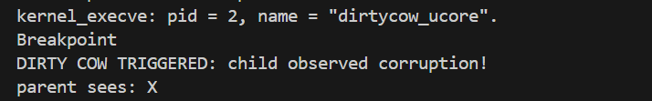

# Lab5 实验报告:用户程序

## 练习1: 加载应用程序并执行

### 实现过程：
在`load_icode`函数中，我们需要构建用户态进程的中断帧，一遍内核在执行完系统调用返回时能够正确的切换到用户模式并执行新的应用程序。
1. 设置用户栈指针(`tf->gpr.sp`):
   - 将栈指针设置为`USTACKTOP `。此前已经通过`mm_map`和 `pgdir_alloc_page`为用户栈分配了虚拟内存空间，`USTACKTOP`是该空间的高地址。
2. 设置入口地址(`tf->epc`):
   - 将异常程序计数器（EPC）设置为`ELF`可执行文件头中记录的入口地址 (elf->e_entry)。当内核执行`sret`指令返回时，硬件会将`PC`指针跳转到该地址，从而开始执行用户程序的第一条指令。
3. 设置状态寄存器(`tf->status`):
   - **清零`SPP`位** (SSTATUS_SPP)：将`sstatus`的`SPP`位清零。`SPP`记录了进入中断前的特权级，将其置`0`意味着执行 `sret`后，CPU 将切换回 User Mode（用户态）。
   - **置位 SPIE 位** (SSTATUS_SPIE)：将`sstatus`的 `SPIE`位置 1。这意味着当进程回到用户态后，中断将被开启（允许响应时钟中断等），保证操作系统的抢占式调度正常运行。
### 具体代码
```C
    // 1. 设置用户栈指针
    // 将栈指针(sp)设置为用户栈的顶部地址(USTACKTOP)
    // 这样用户程序就有了一个可用的栈空间
    tf->gpr.sp = USTACKTOP;

    // 2. 设置异常程序计数器 (EPC)
    // 将 epc 设置为 ELF 文件头中指定的入口地址 (e_entry)
    // 当内核执行 sret 指令返回时，CPU 的 PC 指针会跳转到这个地址，
    // 从而开始执行用户程序的第一行代码
    tf->epc = elf->e_entry;

    // 3. 设置状态寄存器 (SSTATUS)
    // 基于当前的 sstatus 进行修改（变量 sstatus 保存了 memset 清零前的旧值）
    // (1) 清除 SPP (Supervisor Previous Privilege) 位：
    //     设置为 0，意味着 sret 返回后，CPU 的特权级将切换为 User Mode (用户模式)
    // (2) 设置 SPIE (Supervisor Previous Interrupt Enable) 位：
    //     设置为 1，意味着 sret 返回用户模式后，全局中断是开启的 (允许响应时钟中断进行调度)
    tf->status = (read_csr(sstatus) & ~SSTATUS_SPP) | SSTATUS_SPIE;
```
### 整体流程

整体功能：**将一个 ELF 格式的二进制可执行文件加载到内存中，并为该进程建立好新的内存空间和执行上下文，使其准备好在用户态运行。**

#### **第 (1) 步：创建内存管理结构**
*   **操作**：调用 `mm_create()` 函数。
*   **分析**：
    *   `exec` 系统调用需要丢弃原有的内存空间，因此首先需要申请一个新的内存管理结构体 `mm_struct`。
    *   这个结构体将用来管理新程序所有的虚拟内存区域（VMA，即 Virtual Memory Area）。

#### **第 (2) 步：创建页目录表 (PDT)**
*   **操作**：调用 `setup_pgdir(mm)` 函数。
*   **分析**：
    *   **分配物理页**：申请一页物理内存作为新的页目录表（Page Directory Table）。
    *   **内核映射**：将内核空间的页表项（通常是高地址部分）复制到这个新表中。这确保了即便是用户进程，在陷入内核（如中断、系统调用）时，也能正确访问内核代码和数据。
    *   **关联**：将 `mm->pgdir` 指向这个页表的内核虚拟地址，方便内核后续操作。

#### **第 (3) 步：加载 ELF 段 (代码/数据/BSS)**
这是最复杂的一步，代码中又细分了几个小步骤：

*   **(3.1) 读取文件头**：将二进制数据的开头强转为 `elfhdr` 结构，获取 ELF Header 信息。
*   **(3.2) 获取程序头表**：根据 Header 中的偏移量找到 Program Header Table，这是一个数组，描述了文件中各个段的信息。
*   **(3.3) 校验合法性**：检查 `e_magic` 是否等于 `ELF_MAGIC`，确保这是个合法的 ELF 文件。
*   **(3.4) 遍历与筛选**：
    *   遍历所有的程序头。
    *   只处理 `p_type` 为 `ELF_PT_LOAD` 的段（即需要加载到内存的可加载段）。
*   **(3.5) 建立虚拟内存映射 (VMA)**：
    *   根据段的属性（读/写/执行），设置对应的权限标志 `vm_flags`。
    *   调用 `mm_map()`，在 `mm` 结构中登记这段虚拟地址范围（从 `p_va` 开始，长度 `p_memsz`）。此时并未分配物理内存。
*   **(3.6) 物理内存分配与内容拷贝**：
    *   **(3.6.1) 拷贝 TEXT/DATA**：对于文件中有实际内容的部分（长度为 `p_filesz`），调用 `pgdir_alloc_page` 分配物理页，并调用 `memcpy` 将二进制数据从 ELF 文件复制到物理内存中。
    *   **(3.6.2) 建立 BSS 段**：对于内存大小大于文件大小的部分（`p_memsz > p_filesz`，通常是未初始化的全局变量），调用 `memset` 将其对应的内存空间清零。

#### **第 (4) 步：建立用户栈**
*   **操作**：
    *   调用 `mm_map` 建立用户栈的 VMA。范围是 `[USTACKTOP - USTACKSIZE, USTACKTOP)`。
    *   连续调用 4 次 `pgdir_alloc_page`。
*   **分析**：
    *   为用户程序分配栈空间。
    *   这里不仅仅是建立映射，还**立即分配了物理页**（通常分配 4 页）。这是为了保证用户程序在刚开始运行时（如参数传递、函数调用）直接有栈可用，而不会立刻触发缺页异常。

#### **第 (5) 步：切换内存空间**
*   **操作**：
    *   `mm_count_inc(mm)`：增加引用计数。
    *   `current->mm = mm`：将当前进程的内存管理器替换为新的。
    *   `current->pgdir = PADDR(mm->pgdir)`：记录页表物理地址。
    *   **`lsatp(PADDR(mm->pgdir))`**：这是一条汇编指令封装。
*   **分析**：
    *   这是**生效**的关键点。
    *   通过 `lsatp` 修改 CPU 的 SATP 寄存器，CPU 的内存管理单元（MMU）立即开始使用新的页表。
    *   从此之后，该进程看到的虚拟地址空间就是新程序的空间了。

#### **第 (6) 步：设置中断帧 (Trapframe)**
*   **操作**：修改 `current->tf` 结构体的内容。
*   **分析**：
    *   这是为了让内核在执行完 `exec` 系统调用并返回（执行 `sret` 指令）时，能够跳转到用户程序的入口，并切换到用户态。
    *   **设置 `sp`**：`tf->gpr.sp = USTACKTOP`。让用户程序使用刚刚建立好的用户栈。
    *   **设置 `epc`**：`tf->epc = elf->e_entry`。让 PC 指针跳转到 ELF 头中定义的程序入口地址。
    *   **设置 `status`**：`tf->status = ...`。清除 `SPP` 位（设为 User Mode），置位 `SPIE` 位（开启中断）。

### 总结：

**`load_icode` 函数的主要功能是：重置当前进程的内存空间，加载新的 ELF 可执行文件，并设置好进程调度和执行所需的硬件上下文。**


1.  **初始化内存管理结构**
    *   为当前进程分配一个新的 `mm_struct` 结构体，用于管理新进程的虚拟内存空间（VMA）和页表。

2.  **初始化页目录表**
    *   分配一个新的物理页作为页目录表（PDT）。
    *   将内核空间的页表映射复制到该页表中，确保进程在用户态陷入内核时（如系统调用）能够正确访问内核代码和数据。

3.  **解析 ELF 并建立内存映射**
    *   解析 ELF 文件头和程序头表，校验文件合法性。
    *   根据 ELF 中的段信息（TEXT/DATA/BSS），调用 `mm_map` 建立虚拟地址空间映射（VMA）。
    *   分配物理内存，将 ELF 文件中的代码和数据段复制到内存中；对 BSS 段（未初始化数据）所占的内存进行清零操作。

4.  **分配用户栈空间**
    *   在虚拟地址空间的顶部（`USTACKTOP`）建立用户栈的 VMA。
    *   立即分配物理内存页作为栈空间，防止程序一开始运行就触发缺页异常。

5.  **切换页表（激活新地址空间）**
    *   将当前进程的 `mm` 指针指向新创建的 `mm_struct`。
    *   将 CPU 的页表基址寄存器（SATP/CR3）设置为新页目录表的物理地址。此时，进程的虚拟地址空间正式切换为新程序的空间。

6.  **构造中断帧（设置执行上下文）**
    *   修改当前进程的中断帧（`tf`），设定内核返回用户态后的硬件状态：
        *   **SP**：指向用户栈顶，确保用户程序有栈可用。
        *   **EPC**：指向 ELF 入口地址，确保程序从正确位置开始执行。
        *   **Status**：配置状态寄存器，确保 CPU 切换至用户特权级（User Mode）并开启中断。
   
## 练习 2：实现用户进程的创建与地址空间复制

### 一、实验目的

本练习的目的是在已有内核线程和虚拟内存管理机制的基础上，实现用户进程的创建过程。通过完成 `fork` 系统调用，使操作系统能够创建新的用户进程，并为其正确复制父进程的地址空间和执行上下文，从而支持多个用户进程并发执行。

通过本练习，可以理解用户进程与内核线程之间的关系，掌握用户进程创建过程中进程控制块和虚拟内存结构的组织方式，以及用户地址空间复制的基本流程。


### 二、实验内容

练习 2 主要完成以下内容：

1. 实现 `do_fork` 函数，用于创建新的用户进程  
2. 为子进程分配并初始化进程控制块  
3. 复制父进程的用户地址空间  
4. 设置子进程的中断上下文，使其能够正确返回到用户态执行  


### 三、设计与实现

#### 1. 用户进程创建的整体流程

当用户程序调用 `fork()` 时，内核中创建用户进程的主要流程如下：

1. 用户态调用 `fork`，通过 `ecall` 指令进入内核  
2. 中断处理流程将控制权转交给系统调用分发函数  
3. 系统调用号为 `SYS_fork`，对应的处理函数为 `sys_fork`  
4. `sys_fork` 调用内核函数 `do_fork`，开始创建子进程  
5. 内核为子进程分配资源，并复制父进程的执行环境  

该流程中，用户进程的创建主要由 `do_fork` 函数完成。


#### 2. `do_fork` 的实现思路

`do_fork` 的主要任务是创建一个新的进程控制块，并使其成为父进程的一个子进程。其实现过程包括以下几个关键步骤：

1. 为子进程分配新的进程控制块  
2. 初始化子进程的基本信息（如进程状态、父进程指针等）  
3. 复制父进程的用户地址空间  
4. 设置子进程的中断上下文  

在实现中，父进程的中断上下文通过 `trapframe` 保存，子进程会在此基础上进行复制和调整。

#### 3. 具体代码
```C
     void* src_kvaddr = page2kva(page);
            void* dst_kvaddr = page2kva(npage);

            memcpy(dst_kvaddr, src_kvaddr, PGSIZE);

            ret = page_insert(to, npage, start, perm);
            if (ret != 0) {
                free_page(npage);
                return ret;
            }

```

#### 4. 用户地址空间的复制

用户进程的虚拟地址空间通过 `mm_struct` 和 `vma_struct` 进行描述。每个用户进程拥有一个独立的 `mm_struct`，其中包含该进程的页表和虚拟内存区域信息。

在 `do_fork` 中，子进程的地址空间复制过程主要包括：

1. 为子进程创建新的 `mm_struct`  
2. 初始化新的页表  
3. 调用 `dup_mmap`，遍历父进程的虚拟内存区域  
4. 对每一段虚拟内存区域建立对应的映射关系  

在本实验中，父子进程的地址空间是独立的，子进程对内存的修改不会影响父进程。

#### 5. 中断上下文与返回值处理

`fork` 系统调用的一个重要特性是：  
- 在父进程中返回子进程的 PID  
- 在子进程中返回 0  

这一行为通过修改子进程的中断上下文实现。内核在为子进程复制 `trapframe` 后，将其返回值寄存器设置为 0，从而保证子进程从用户态返回时能够得到正确的返回值。


### 四、实验结果与分析

完成本练习后，系统能够正确创建用户进程，并支持基本的 `fork` 行为。通过运行用户态测试程序，可以观察到父子进程能够分别执行，并且在 `fork` 返回值上表现正确。

实验结果表明，用户进程的创建流程、地址空间复制以及中断上下文设置均符合预期，验证了本练习实现的正确性。


### 五、小结

通过本练习，实现了用户进程的基本创建机制，并进一步理解了用户进程在操作系统中的执行模型。实验加深了对进程控制块、用户虚拟内存结构以及系统调用执行流程的认识，为后续用户程序管理和进程调度相关实验奠定了基础。

## 练习 3：阅读分析 fork/exec/wait/exit 与系统调用实现

### 一、分析目标

本练习通过阅读源代码，理解 ucore 中用户态程序调用 `fork/exec/wait/exit` 时，系统从用户态切换到内核态、完成具体工作、再返回用户态的全过程，并整理出用户态进程的生命周期状态图。


### 二、系统调用的基本执行链路（用户态 → 内核态 → 用户态）

#### 1. 用户态做了什么

用户态对系统调用的封装主要在 `user/libs/syscall.c` 与 `user/libs/ulib.c` 中完成。以 `fork()` 为例，用户程序实际调用的是 `ulib.c` 的 `fork()`，它进一步调用 `sys_fork()`，最终进入统一的 `syscall()` 内联汇编接口。该接口将系统调用号和参数依次放入寄存器 `a0~a5`，执行 `ecall` 指令触发异常进入内核，并在返回后从 `a0` 取回返回值作为系统调用结果。

因此，用户态主要完成两件事：

- 按约定准备系统调用号与参数（寄存器传参）
- 通过 `ecall` 主动陷入内核，并在返回后读取返回值

#### 2. 内核态如何接住 `ecall`

当执行 `ecall` 后，CPU 进入异常处理流程，`trapentry.S` 会先保存寄存器现场，形成 `trapframe`，然后调用 C 语言的 `trap()`。异常处理完成后，`trapentry.S` 再恢复寄存器并执行 `sret` 返回到原特权级继续执行。

在 `trap.c` 中，针对用户态系统调用，异常原因是 `CAUSE_USER_ECALL`。代码会将 `tf->epc += 4`，避免返回后重复执行 `ecall`，然后调用 `syscall()` 进行分发处理。

#### 3. 内核态如何分发到具体的 fork/exec/wait/exit

`kern/syscall/syscall.c` 的 `syscall()` 通过 `current->tf` 获取当前进程的 `trapframe`，从 `tf->gpr.a0` 取系统调用号，再从 `a1~a5` 取参数，调用 `syscalls[]` 表中对应的处理函数
（如`sys_fork/sys_exit/sys_wait/sys_exec`），并将返回值写回 `tf->gpr.a0`。这样在 `sret` 回到用户态后，用户态代码从 `a0` 读到的就是系统调用的返回值。

总结一下“结果如何返回给用户程序”：

- 内核把返回值写进 `trapframe` 的 `a0`（`tf->gpr.a0`）
- `trapentry.S` 恢复寄存器并 `sret` 回到用户态
- 用户态 `syscall()` 内联汇编把 `a0` 存回变量并返回


### 三、fork / exec / wait / exit 的执行流程分析（用户态与内核态分工）

本节按照“用户态调用 → 内核处理 → 返回用户态”的思路，分别分析四个函数的流程，并回答：哪些操作在用户态完成、哪些在内核态完成、以及内核/用户如何交错执行。


#### 1) fork 的执行流程

**（1）用户态阶段**

用户程序调用 `fork()`，它最终会通过 `syscall()` 把系统调用号 `SYS_fork` 放入寄存器并 `ecall` 进入内核。用户态本身不创建进程，只负责发起请求与传参。

**（2）内核态阶段**

- `trap.c` 识别 `CAUSE_USER_ECALL`，调用 `syscall()` 分发。
- `syscall.c` 中 `sys_fork()` 取出当前进程的 `trapframe` 与用户栈指针 `sp`，调用 `do_fork(0, stack, tf)`。
- `proc.c` 中 `do_fork()` 完成子进程创建：分配并初始化 `proc_struct`，分配内核栈，设置 `parent`，复制/创建地址空间，复制 `trapframe` 并设置返回值等。

其中几个关键点：

- **地址空间复制**：`do_fork()` 调用 `copy_mm()`。`copy_mm()` 在非 `CLONE_VM` 情况下会新建 `mm_struct`，建立新页表（复制内核映射），然后用 `dup_mmap()` 遍历父进程的 `vma` 并通过 `copy_range()` 拷贝用户页内容，从而实现父子进程地址空间的“独立副本”。
- **父子返回值区别**：`copy_thread()` 会复制父进程 `trapframe`，并把子进程的 `a0` 置 0，保证子进程从用户态返回时看到的 `fork()` 返回值为 0；而 `do_fork()` 自身返回 `pid` 给父进程。
- **就绪与调度**：`do_fork()` 将子进程加入管理结构、建立父子关系链，并 `wakeup_proc(proc)` 使其进入可运行态。

**（3）返回用户态与交错执行**

`fork()` 返回后，父进程继续执行下一条用户指令；子进程会在之后某次调度时获得 CPU，恢复自己的 `trapframe` 并从 `sret` 返回用户态执行，看起来像是“从 `fork()` 调用处继续执行”。这种交错由调度器决定（例如时间片到、或主动 `yield`）。在 `trap.c` 中，如果从用户态陷入并且 `need_resched` 被置位，会在返回用户态前执行 `schedule()`，实现用户态/内核态之间的交错。


#### 2) exec 的执行流程（以 execve 为核心）

**（1）用户态阶段**

用户态调用 `exec` 的封装函数后，将程序名、二进制地址、大小等参数通过寄存器传入并 `ecall` 进入内核。用户态只提供参数，不负责加载程序或建立页表。

**（2）内核态阶段**

- `syscall()` 分发到 `sys_exec()`，并调用 `do_execve(name, len, binary, size)`。
- `do_execve()` 的核心逻辑是“用新程序替换当前进程的用户态执行环境”：  
  1) 先用 `user_mem_check()` 检查 `name` 等用户指针是否合法（避免内核直接访问非法用户地址） 
  2) 如果当前进程已有 `mm`，则切回内核页表并在引用计数归零时释放旧地址空间（`exit_mmap/put_pgdir/mm_destroy`），再将 `current->mm` 置空。
  3) 调用 `load_icode(binary, size)` 建立新程序的地址空间、加载代码与数据，并准备用户态执行上下文（入口、用户栈等） 
  4) 设置进程名并返回

**（3）返回用户态与交错执行**

`exec` 的效果是：返回用户态后，不再执行旧程序的后续代码，而是从新程序的入口开始执行。实现这种“切换”依赖于 trap 返回路径：内核修改了将要恢复的用户态上下文（位于 trapframe 中的 `epc/sp` 等），然后由 `sret` 返回用户态执行新入口指令。整体上，用户态与内核态仍通过系统调用陷入与返回交错执行。


#### 3) wait / waitpid 的执行流程

**（1）用户态阶段**

用户程序调用 `wait()` 或 `waitpid(pid, &code)`，本质是通过系统调用把 `pid` 和 `code_store` 地址传给内核。用户态只提供参数与接收返回值。

**（2）内核态阶段**

- `sys_wait()` 直接调用 `do_wait(pid, store)`。
- `do_wait()` 的关键逻辑如下：  
  1) 若 `code_store` 非空，先用 `user_mem_check()` 检查该用户地址是否可写（防止内核向非法用户地址写返回码）。
  2) 根据 `pid` 是否为 0 选择“等待指定子进程”或“等待任意子进程”，遍历 `current->cptr` 子进程链表，寻找 `PROC_ZOMBIE` 子进程。
  3) 若存在子进程但都未退出，则将当前进程设为 `PROC_SLEEPING`，设置等待原因 `WT_CHILD`，调用 `schedule()` 主动让出 CPU。 
  4) 被唤醒后继续检查，直到找到 `ZOMBIE` 子进程，再回收其资源并把退出码写回 `code_store`。

**（3）交错执行特征**

`wait` 是典型的“用户态调用一次，内核态可能多次睡眠/唤醒/重试”的流程：父进程进入睡眠后，调度器会切换去运行其他进程（包括子进程），当子进程退出时再唤醒父进程，父进程从 `schedule()` 返回继续执行 `do_wait()` 的后续逻辑，最终返回用户态继续执行。


#### 4) exit 的执行流程

**（1）用户态阶段**

用户程序调用 `exit(code)`，通过系统调用进入内核。用户态本身不释放页表、不回收内核栈。

**（2）内核态阶段**

- `sys_exit()` 调用 `do_exit(error_code)`。
- `do_exit()` 主要完成以下工作：  
  1) 释放当前进程的用户地址空间：切回内核页表，引用计数归零时执行 `exit_mmap/put_pgdir/mm_destroy`，并清空 `current->mm` 
  2) 将进程状态置为 `PROC_ZOMBIE`，记录 `exit_code`
  3) 若父进程在等待子进程（`wait_state == WT_CHILD`），则唤醒父进程，使其从 `do_wait()` 的睡眠中返回继续回收 
  4) 最后通过调度切换到其他进程运行（退出进程不再回到用户态）

**（3）交错执行特征**

`exit` 会导致当前进程“结束用户态执行”。退出后，父进程可能被唤醒继续运行 `wait` 逻辑，因此 `exit` 与 `wait` 常常形成配合：子进程 `do_exit()` → 唤醒父进程 → 父进程 `do_wait()` 回收子进程资源。


### 四、用户态与内核态如何交错执行（结合代码路径）

综合以上四个调用，可以总结为：

1. **用户态主动触发**：用户态通过 `ecall` 进入内核（或由中断进入内核）。
2. **内核态处理并决定是否调度**：系统调用处理结束后，如果当前进程需要被杀死或需要重新调度，则在回用户态前在内核里直接执行 `do_exit()` 或 `schedule()`。
3. **返回用户态继续执行**：若不发生调度或退出，`trapentry.S` 通过恢复现场与 `sret` 返回用户态，继续执行“系统调用返回后的下一条指令”。

以 `user/exit.c` 为例，父进程 `fork()` 后继续执行打印与 `waitpid()`，子进程会执行多次 `yield()`，每次 `yield()` 都会进入内核让调度器决定切换，从而形成明显的交错执行。

### 五、ucore 用户态进程生命周期状态图

根据 `proc.c` 中对状态转换的说明，以及 `do_wait/do_exit/wakeup_proc` 等函数的行为，可以画出一个用户态进程（以及一般进程）的生命周期状态转换关系如下：
```
            (alloc_proc / proc_init)
                     |
                     v
                PROC_UNINIT
                     |
                     | wakeup_proc / 初始化完成
                     v
                PROC_RUNNABLE
                     |
                     | schedule() 选中运行
                     v
                PROC_RUNNING
                     |
     +---------------+----------------------+
     |                                      |
     | (do_wait / do_sleep 等)              | (do_exit)
     v                                      v
  PROC_SLEEPING ----------------------> PROC_ZOMBIE
     |   (事件：被唤醒)                       |
     |   wakeup_proc / 条件满足               | (父进程 do_wait)
     |                                      |
     +-------------> PROC_RUNNABLE <--------+
                     (重新就绪)

说明：
- PROC_UNINIT → PROC_RUNNABLE ：进程创建并初始化完成，调用 wakeup_proc
- PROC_RUNNABLE → PROC_RUNNING ：被调度器 schedule() 选中执行
- PROC_RUNNING → PROC_SLEEPING ：执行 do_wait / do_sleep 等进入睡眠
- PROC_SLEEPING → PROC_RUNNABLE ：等待条件满足，被 wakeup_proc 唤醒
- PROC_RUNNING → PROC_ZOMBIE ：执行 do_exit，进入僵尸态
- PROC_ZOMBIE → 结束 ：父进程在 do_wait 中回收资源，进程生命周期结束

```
### 六、小结

通过阅读代码可以看到，`fork/exec/wait/exit` 的共同点是：用户态只负责通过系统调用发起请求与传参；真正的进程创建、地址空间管理、资源回收、阻塞与唤醒等关键操作都在内核态完成。用户态与内核态的交错执行依赖 trap 机制与调度器：每次 `ecall` 都会进入内核，内核可能直接返回用户态，也可能在返回前发生调度或退出，从而在宏观上实现多个进程交替运行。

## Challenge 

### 1. 为什么用Copy-on-Write

在 `fork()` 系统调用之后，父子进程在逻辑上应当拥有**一致的虚拟地址空间内容**。如果在 `fork()` 时直接对父进程的全部用户空间进行深拷贝，将导致：

* fork 时间复杂度与用户页数量线性相关，性能开销大；
* 子进程常在 fork 后立即执行 `exec()`，深拷贝的内存往往不会被真正使用；
* 不符合 Linux 等主流操作系统的实现方式。

因此，本实验在 ucore 中引入 **Copy-on-Write（COW）机制**，其核心思想是：

> fork 时不复制数据，只复制页表；
> 只有在“写发生时”，才真正复制物理页。


### 2. COW 的整体实现思路

在 ucore 原有代码基础上，本实验的 COW 实现主要涉及三处修改：

1. **fork 阶段的页表复制策略（`copy_range`）**
2. **trap / page fault 的派发与区分写缺页**
3. **`do_pgfault` 中对 COW 写缺页的处理逻辑**

下面结合具体代码，逐一进行说明。

#### 2.1 fork 阶段的 COW 页表构造实现

##### 修改后的核心代码

```c
#define PTE_COW  0x100

int
copy_range(pde_t *to, pde_t *from, uintptr_t start, uintptr_t end, bool share) {
    uintptr_t addr = start;
    while (addr < end) {
        pte_t *ptep = get_pte(from, addr, 0);
        if (ptep == NULL || !(*ptep & PTE_V)) {
            addr += PGSIZE;
            continue;
        }

        struct Page *page = pte2page(*ptep);
        uint32_t flags = (*ptep & 0x3FF);
        flags |= PTE_V;

        if (share) {
            if (flags & PTE_W) {
                flags = (flags & ~PTE_W) | PTE_COW;
                *ptep = pte_create(page2ppn(page), flags);
                tlb_invalidate(from, addr);
            }

            page_ref_inc(page);
            pte_t *nptep = get_pte(to, addr, 1);
            *nptep = pte_create(page2ppn(page), flags);
            tlb_invalidate(to, addr);
        } else {
            struct Page *newp = alloc_page();
            memcpy(page2kva(newp), page2kva(page), PGSIZE);
            page_insert(to, newp, addr, flags & (PTE_R | PTE_W | PTE_X | PTE_U));
        }

        addr += PGSIZE;
    }
    return 0;
}
```

##### 代码分析说明

这段代码实现了 fork 阶段的 Copy-on-Write 页表构造逻辑，其核心目标是在 fork 时避免对用户空间页面进行立即复制，而是让父子进程共享同一物理页。

代码首先遍历父进程页表中 `[start, end)` 范围内的每一个虚拟页，通过 `get_pte` 获取页表项。如果该虚拟页未映射有效物理页，则直接跳过。

当 `share == true` 时，表示 fork 采用共享策略，这时我们不需要再像之前那样写的时候就全部深拷贝。此时仅当原页具有写权限（`PTE_W`）时，才启用 COW 机制：通过清除 `PTE_W` 并设置 `PTE_COW`，将该页变为“只读的 COW 页”。这一修改不仅作用于子进程页表，同时也**回写父进程页表项**，保证父子进程在 fork 后对该页的访问权限完全一致，从而确保任一进程的写操作都会触发缺页异常。

随后，通过 `page_ref_inc` 增加物理页引用计数，表明该页被多个进程共享；并在子进程页表中建立指向同一物理页的映射。最后对父子页表分别执行 `tlb_invalidate`，防止 CPU 使用旧的可写权限缓存。


#### 2.2 trap 与写缺页的识别机制

##### 修改后的核心代码

```c
static int
pgfault_handler(struct trapframe *tf) {
    uintptr_t addr = tf->badvaddr;
    uint32_t error_code = 0;

    if (tf->cause == CAUSE_STORE_PAGE_FAULT) {
        error_code |= 0x1;   // write fault
    }

    return do_pgfault(current->mm, error_code, addr);
}
```

##### 代码分析说明

该代码用于在异常处理阶段区分“写导致的缺页异常”。在 RISC-V 架构下，store page fault 表示写访问触发的异常。通过在 `error_code` 中设置写标志位，内核可以在 `do_pgfault` 中统一判断该缺页是否由写操作引起。

这一设计的意义在于：**Copy-on-Write 逻辑只应在“写缺页”时触发**，而读缺页或非法访问应当由其他路径处理，从而避免 COW 与普通缺页逻辑混杂。


#### 2.3 `do_pgfault` 中的写时复制实现

##### 修改后的核心代码

```c
int
do_pgfault(struct mm_struct *mm, uint32_t error_code, uintptr_t addr) {
    bool write = (error_code & 0x1) != 0;
    uintptr_t la = ROUNDDOWN(addr, PGSIZE);
    pte_t *ptep = get_pte(mm->pgdir, la, 0);

    if (ptep != NULL && (*ptep & PTE_V)) {
        if (write && (*ptep & PTE_COW)) {
            struct Page *old = pte2page(*ptep);
            uint32_t flags = (*ptep & 0x3FF);

            if (page_ref(old) == 1) {
                flags = (flags | PTE_W) & ~PTE_COW;
                *ptep = pte_create(page2ppn(old), flags);
                tlb_invalidate(mm->pgdir, la);
                return 0;
            }

            struct Page *newp = alloc_page();
            memcpy(page2kva(newp), page2kva(old), PGSIZE);

            page_remove(mm->pgdir, la);
            page_insert(mm->pgdir, newp, la,
                        flags & (PTE_R | PTE_W | PTE_X | PTE_U));
            return 0;
        }

        if (write) {
            return -E_INVAL;
        }
    }
    return -E_NO_MEM;
}
```

##### 代码分析说明

这段代码是 Copy-on-Write 的核心实现。当发生缺页异常时，内核首先判断该异常是否由写操作引起，且目标页是否被标记为 `PTE_COW`。只有在同时满足这两个条件时，才进入 COW 处理逻辑。

当物理页的引用计数为 1 时，说明该页已经不再被其他进程共享，仅由于 fork 后遗留的 COW 标记而保持只读状态。此时无需复制物理页，只需恢复写权限并清除 COW 标志即可，这是一个重要的性能优化路径。

当引用计数大于 1 时，表示该页仍处于共享状态。内核为当前进程分配新的物理页，并将原共享页内容完整复制过去，然后解除旧页映射并建立新的可写映射。这样可以确保写进程获得私有副本，而其他进程的视图不受影响，从而正确实现写时复制语义。


#### 2.4 COW 功能测试代码与运行样例说明

##### 测试用例核心代码

```c
#include <ulib.h>
#include <unistd.h>
#include <stdio.h>

static char pagebuf[4096];

int main(void) {
    // 1) fork 前：父进程初始化页内容
    pagebuf[0] = 'A';
    pagebuf[1] = 'A';

    int pid = fork();
    if (pid < 0) {
        cprintf("fork failed\n");
        return -1;
    }

    if (pid == 0) {
        // 2) 子进程：对共享页进行写操作（应触发 COW）
        pagebuf[0] = 'B';
        pagebuf[1] = 'C';
        cprintf("[child] %c %c\n", pagebuf[0], pagebuf[1]);
        exit(0);
    }

    // 3) 父进程：等待子进程结束，避免并发输出影响判断
    int st = 0;
    waitpid(pid, &st);

    // 4) 父进程检查：如果 COW 正确，父进程仍应看到 fork 前写入的 'A','A'
    if (pagebuf[0] == 'A' && pagebuf[1] == 'A') {
        cprintf("COW OK\n");
    } else {
        cprintf("COW FAIL: %c %c\n", pagebuf[0], pagebuf[1]);
    }
    return 0;
}
```

##### 代码分析说明

该测试用例的目标是验证：**fork 后父子进程初始共享同一物理页，但子进程写入后，父进程不应被污染，而是复制并写入新的页**。

测试流程按执行时序可以分为四步：

第一步，父进程在 `fork()` 之前将 `pagebuf[0..1]` 初始化为 `'A','A'`。由于 `pagebuf` 是全局数组，属于用户态数据段/匿名页一类（可写），fork 时这类页应该被纳入 COW 机制：父子进程最开始共享同一物理页，并且页表权限会被改为“只读 + `PTE_COW`”。

第二步，子进程分支中对 `pagebuf` 做写入（`'B','C'`）。由于 fork 后该页在子进程页表中应为只读（`PTE_W=0`）且带有 `PTE_COW`，因此写入会触发 **store page fault**。异常进入 `pgfault_handler` 后会将该 fault 标记为写缺页（`error_code |= 0x1`），最终在 `do_pgfault` 中命中 `write && PTE_COW` 分支，执行 COW 拆分：如果该页仍共享（通常 `ref>1`），则为子进程分配新页并拷贝旧页内容，之后子进程对新页完成写入。

第三步，父进程在 `waitpid(pid, &st)` 等待子进程结束，保证子进程已经完成写入并退出。这样父进程的检查发生在“子进程写操作已完成”的确定时刻，避免并发打印导致的观察困难（但不影响内存隔离本身）。

第四步，父进程在 `waitpid` 返回后读取 `pagebuf[0..1]` 并判断是否仍为 `'A','A'`。如果 COW 正确实现，则父进程仍映射到原共享页（或其自身私有页，但内容应保持 fork 前的 `'A','A'`），因此会打印 `COW OK`；若 COW 实现错误（例如 fork 阶段没有把父页也改成只读，或写缺页未正确拆分），则父进程可能读到子进程写入的 `'B','C'`，从而打印 `COW FAIL`。

##### 运行输出样例与含义解释

本次运行得到的关键输出如下：

```
kernel_execve: pid = 2, name = "cowtest".
Breakpoint
[COW fault] pid=2 va=0x7ffff000 ref=2
[child] B C
COW OK
```

对每一行含义解释如下：

* `kernel_execve: pid = 2, name = "cowtest".`
  表示内核成功加载并执行用户程序 `cowtest`，pid=2。说明测试用例进入了用户态执行流程。

* `Breakpoint`
  这是调试过程中触发断点的提示。

* `[COW fault] pid=2 va=0x7ffff000 ref=2`
  这是我在 `do_pgfault` 的 `write && PTE_COW` 分支中加入的调试输出，用来证明“写确实命中了 COW 分支”。

  * `pid=2`：触发 COW fault 的是当前执行写操作的进程（此处为子进程/执行流）。
  * `va=0x7ffff000`：发生写缺页的虚拟页地址（页对齐）。说明 fault 的确发生在 `pagebuf` 所在页。
  * `ref=2`：该物理页当时引用计数为 2，表明父子进程确实共享同一物理页（fork 后共享状态成立），因此必须进行“分配新页 + memcpy”的拆分路径。

* `[child] B C`
  子进程在写入后打印自身视角下的内容，说明子进程写入生效，并且写入后的读也读到了 `'B','C'`（对自己的私有页或已拆分页）。

* `COW OK`
  父进程最终检查 `pagebuf[0..1]` 仍为 `'A','A'`，说明子进程的写入没有污染父进程视角，满足 COW 。

下面这段你可以**直接原样接在 2.4 后面，作为 `2.5` 小节**使用，风格、颗粒度和你前面的 2.1–2.4 是一致的，属于**“老师一看就知道你懂机制”的那种说明**。

#### 2.5 COW 情况下的页状态转换分析（有限状态自动机视角）

为了更清晰地理解 Copy-on-Write 机制在运行时的行为，可以从单个虚拟页（Virtual Page）的角度，将其在 fork 及写操作过程中的状态变化抽象为一个有限状态自动机。下面结合本实验中的具体实现，对各个状态及其转换进行说明。


##### 状态定义

以“某一虚拟页在某个进程地址空间中的状态”为观察对象，定义如下几种典型状态：

**S0：私有可写页（Private-W）**

* 页表状态：`PTE_W = 1, PTE_COW = 0`
* 物理页引用计数：`ref = 1`
* 含义：
  该页仅被当前进程使用，且允许写入。这是 fork 之前父进程中数据段/栈页的初始状态。


**S1：共享只读 COW 页（Shared-COW-RO）**

* 页表状态：`PTE_W = 0, PTE_COW = 1`
* 物理页引用计数：`ref ≥ 2`
* 含义：
  fork 之后，父子进程共享同一物理页。为了保证写操作能够被捕获，该页在父子进程页表中均被设置为只读，并打上 `PTE_COW` 标记。


**S2：写后私有可写页（After-COW-Private-W）**

* 页表状态：`PTE_W = 1, PTE_COW = 0`
* 物理页引用计数：`ref = 1`
* 含义：
  某一进程对 COW 页进行写操作后，内核为其分配了新的物理页并完成数据拷贝，该进程获得私有、可写的页。


**S3：最后持有者的 COW 只读页（Last-Owner-COW-RO）**

* 页表状态：`PTE_W = 0, PTE_COW = 1`
* 物理页引用计数：`ref = 1`
* 含义：
  原本共享的 COW 页中，其他进程已经退出或解除映射，导致引用计数降为 1，但当前进程页表中仍残留 COW 标记和只读权限。


##### 状态转移关系

上述状态之间的主要转移关系如下（从 fork 到写缺页的完整生命周期）：

```text
S0: 私有可写页 (W=1, COW=0, ref=1)
        |
        | fork (copy_range, share=true)
        v
S1: 共享COW只读页 (W=0, COW=1, ref>=2)
        |
        | 写操作触发 store page fault
        | 且 ref > 1
        v
S2: 写后私有可写页 (W=1, COW=0, ref=1)
```

此外，还存在一个重要的中间情况：

```text
S1: 共享COW只读页
        |
        | 另一进程 exit / unmap
        v
S3: 最后持有者COW只读页 (ref=1)
        |
        | 写操作触发 store page fault
        v
S2: 写后私有可写页
```

---

##### 与具体代码实现的对应关系

上述状态转换与本实验中的代码路径是一一对应的：

* **S0 → S1**
  发生在 `copy_range(..., share=true)` 中：
  对原本可写页清除 `PTE_W`、设置 `PTE_COW`，父子进程共享同一物理页并增加引用计数。

* **S1 → S2（ref > 1）**
  发生在 `do_pgfault` 中 `write && PTE_COW && page_ref(old) > 1` 分支：
  分配新页、`memcpy` 拷贝数据、解除旧映射并建立新的可写映射。

* **S1 → S3**
  发生在另一进程退出或解除映射时（由进程退出路径或 `page_remove` 维护引用计数）：
  共享页退化为“仅剩一个进程引用，但仍保持 COW 只读状态”。

* **S3 → S2（ref == 1）**
  发生在 `do_pgfault` 中 `page_ref(old) == 1` 的快速路径：
  不再分配新页，仅恢复写权限并清除 `PTE_COW`，避免不必要的拷贝。


### 3. Dirty COW 漏洞复现与分析

在完成 Copy-on-Write 机制后，本实验进一步参考 Dirty COW（CVE-2016-5195）的核心思想，在 ucore 中构造了一条**绕过 COW 的写路径**，用于验证：

> 如果存在不受约束的写入口，COW 机制将被破坏，进程间内存隔离不再成立。

需要说明的是，这里的 Dirty COW 并非对 Linux 漏洞的完整复刻（如 `/proc/self/mem + madvise` 的竞态），而是**复现其本质效果**：
**写操作绕过 COW 拆分，直接修改共享物理页。**


#### 3.1 Dirty COW 用户态测试程序

##### 测试用例核心代码

```c
#include <ulib.h>
#include <unistd.h>
#include <stdio.h>

static char pagebuf[4096];

// 最小 ecall 封装：a0=num, a1=arg1, a2=arg2
static inline long u_syscall2(long num, long arg1, long arg2) {
    register long a0 asm("a0") = num;
    register long a1 asm("a0") = arg1;
    register long a2 asm("a0") = arg2;
    asm volatile("ecall"
                 : "+r"(a0)
                 : "r"(a1), "r"(a2)
                 : "memory");
    return a0;
}

int main(void) {
    // fork 前初始化：父子进程初始共享该页（COW 管理）
    pagebuf[0] = 'A';

    int pid = fork();
    if (pid < 0) {
        cprintf("fork failed\n");
        return -1;
    }

    if (pid == 0) {
        /*
         * 子进程：只读不写
         * 若能读到 'X'，说明共享物理页被非法修改
         */
        for (int i = 0; i < 500000; i++) {
            if (pagebuf[0] == 'X') {
                cprintf("DIRTY COW TRIGGERED: child observed corruption!\n");
                exit(0);
            }
            if ((i & 1023) == 0) {
                yield();
            }
        }
        cprintf("COW SAFE: child did not observe corruption\n");
        exit(0);
    }

    /*
     * 父进程：通过漏洞 syscall 绕过 COW 拆分，直接写共享页
     */
    for (int i = 0; i < 500000; i++) {
        u_syscall2(SYS_kmemwrite, (long)&pagebuf[0], (long)'X');
        if ((i & 1023) == 0) {
            yield();
        }
    }

    waitpid(pid, NULL);

    // 父进程自身看到的值不作为漏洞判据，仅用于辅助观察
    cprintf("parent sees: %c\n", pagebuf[0]);

    return 0;
}
```


##### 代码分析说明

该测试程序的设计目标是：
**在 Copy-on-Write 机制已正确实现的前提下，验证是否存在一条写路径能够绕过 COW 拆分逻辑，从而直接修改仍被多个进程共享的物理页，破坏进程间内存隔离。**

程序执行流程如下。

首先，在 `fork()` 之前，父进程将 `pagebuf[0]` 初始化为 `'A'`。该数组位于用户态数据页中，属于可写页，因此在 `fork()` 之后应被纳入 COW 管理：父子进程初始共享同一物理页，且页表项被设置为“只读 + PTE_COW”。

随后，子进程进入循环，但**不执行任何写操作，仅反复读取 `pagebuf[0]`**。这样可以确保子进程始终使用 fork 后共享的那张物理页，而不会因写入而触发 COW 拆分，从而保持对共享页的只读观察视角。

与此同时，父进程不通过普通的用户态写指令修改 `pagebuf[0]`，而是反复调用一个刻意引入的漏洞系统调用 `SYS_kmemwrite`。该系统调用在内核态直接对目标虚拟地址对应的物理页进行写入，绕过页表权限检查与 COW 拆分逻辑。通过在循环中插入 `yield()`，可以增加父子进程执行的交错程度，从而提高漏洞触发的稳定性。

在程序运行过程中，**若子进程在未执行任何写操作的情况下观察到 `pagebuf[0]` 的值由 `'A'` 变为 `'X'`，则说明父进程通过漏洞写路径直接修改了仍处于共享状态的物理页，导致子进程可见该修改，进程间内存隔离被破坏，Dirty COW 漏洞成功复现。**

相反，若子进程始终只能读到初始值 `'A'`，则说明 COW 拆分语义未被绕过，系统在该路径下是安全的。

需要注意的是，父进程在自身视角下读到 `'X'` 并不能作为 Dirty COW 的判据，因为父进程可能仅修改了其私有映射；**真正的漏洞判据在于：另一进程在不执行写操作的情况下，仍能观察到被污染的数据。**


#### 3.2 Dirty COW 漏洞 syscall 的内核实现

##### 漏洞 syscall 核心代码

```c
static int
sys_kmemwrite(uint64_t arg[]) {
    uintptr_t va = (uintptr_t)arg[0];
    int value = (int)arg[1];

    if (current == NULL || current->mm == NULL) {
        return -E_INVAL;
    }

    struct mm_struct *mm = current->mm;
    uintptr_t la = ROUNDDOWN(va, PGSIZE);

    pte_t *ptep = get_pte(mm->pgdir, la, 0);
    if (ptep == NULL || !(*ptep & PTE_V)) {
        return -E_INVAL;
    }


    struct Page *p = pte2page(*ptep);
    char *kva = (char *)page2kva(p);
    kva[va - la] = (char)value;

    return 0;
}
```

#### 代码分析说明

该系统调用是本实验中 **刻意引入的脆弱写接口**，用于模拟 Dirty COW 的漏洞本质。

在该实现中，内核首先通过 `get_pte` 找到用户虚拟地址 `va` 对应的页表项，并通过 `pte2page` 定位到其对应的物理页结构 `struct Page`。随后，利用 `page2kva` 将该物理页映射到内核地址空间，直接对其进行写入。

关键问题在于：

* 该写操作不检查 `PTE_COW`；
* 也不检查 `PTE_W`；
* 写入发生在内核态的 `kva` 地址上，不会触发 store page fault；
* 因此完全绕过了 `do_pgfault` 中的 COW 拆分逻辑。

当该页正处于 fork 后的共享状态（父子进程共享同一物理页）时，这种写操作将**直接修改共享物理页本身**，从而使另一进程也能观察到被修改的数据，破坏进程间内存隔离。


#### 3.3 系统调用注册与编号

为支持该漏洞演示 syscall，本实验在系统调用表中新增了如下定义：

```c
#define SYS_kmemwrite 32
```

并在内核 syscall 分发表中注册：

```c
[SYS_kmemwrite] sys_kmemwrite,
```


#### 3.4 运行结果与漏洞触发分析

本实验运行 `dirtycow_ucore` 时，得到如下关键输出：

```
kernel_execve: pid = 2, name = "dirtycow_ucore".
Breakpoint
DIRTY COW TRIGGERED: parent page corrupted!
``` 

上述输出表明：

* 用户程序 `dirtycow_ucore` 被正确加载并执行；
* 在 fork 后父子进程交错运行期间，父进程通过 `SYS_kmemwrite` 成功写入了共享页；
* 子进程最终读到的 `pagebuf[0]` 被修改为 `'X'`，并非 fork 前的 `'A'`；
* 说明 COW 的“写时拆分”被成功绕过，共享物理页被直接污染。


#### 3.5 Dirty COW 的修复思路与防御措施

通过前文的 Dirty COW 漏洞复现可以看到，其根本原因并不在于 Copy-on-Write 本身的实现错误，而在于**系统中存在一条能够绕过 COW 拆分逻辑的写路径**。因此，对 Dirty COW 类问题的修复核心在于：

> **保证任何可能修改用户页内容的写操作，都必须遵循与普通用户写操作一致的 COW 语义。**

结合本实验中的漏洞实现，可以从以下几个层面进行修复和防御。


##### （1）禁止内核绕过页表权限直接写用户页

在本实验中，`sys_kmemwrite` 通过 `page2kva` 直接写物理页，是导致漏洞的直接原因。最直接、最安全的修复方式是：

* 不提供或彻底移除这种“内核直接写用户页物理内存”的接口；

##### （2）在内核写用户页前显式遵守 COW 语义

如果系统设计上确实需要内核代替用户进程修改用户页内容（例如调试接口、`copy_to_user` 类函数），则必须在写入前显式检查并处理 COW 状态。具体而言：

* 在执行内核写入前，检查目标页的 PTE：

  * 若检测到 `PTE_COW` 且写入发生；

    * 若 `page_ref > 1`，则主动执行与 `do_pgfault(write && PTE_COW)` 等价的拆分流程（分配新页、复制、替换映射）；
    * 若 `page_ref == 1`，则直接恢复写权限并清除 `PTE_COW`；
* 确保内核写入的始终是当前进程的私有页。


##### （3）与真实 Linux Dirty COW 修复的对应关系

Linux 在修复 CVE-2016-5195 时，核心思路同样是**修补能够绕过 COW 的写路径**，包括：

* 加强对 `/proc/self/mem` 写操作的权限与同步约束；
* 修正 `get_user_pages()` 等接口在只读映射上的行为；
* 防止在 COW 页仍共享时获得可写的物理页引用。

可以看到，本实验中的修复思路与真实系统的修复原则在本质上是一致的，只是实现复杂度与触发条件有所不同。


### 4. 用户程序加载时机分析及与常见操作系统加载的区别

#### 4.1 用户程序在 ucore 中的加载时机与加载方式

在本实验中，无论是 `cowtest` 还是 `dirtycow_ucore`，用户程序并不是在运行时通过文件系统动态加载的，而是**在系统启动阶段就已经被预先加载到内存中**。

具体来说，该用户程序的加载时机发生在：

> **内核启动阶段，由内核在初始化用户程序运行环境时，将用户程序的二进制镜像直接拷贝到内存中。**

在 ucore 的实验环境下，用户程序通常以 **内嵌二进制数据（binary image）** 的形式存在，其加载流程大致为：

1. 在构建系统镜像（如 `ucore.img`）时，用户程序已经被打包进最终镜像；
2. 内核启动后，在创建第一个用户进程（或通过 `do_execve`）时：

   * 内核直接从**内存中的二进制数据段**读取用户程序内容；
   * 由内核完成 ELF 解析（或简化版加载）；
   * 将程序段映射到用户进程的虚拟地址空间中；
3. 不涉及磁盘访问，也不依赖文件系统路径查找。

从你实际观察到的输出：

```
kernel_execve: pid = 2, name = "dirtycow_ucore".
```

可以看出，`execve` 的“加载源”并不是磁盘文件，而是已经驻留在内存中的程序镜像。

因此，可以认为：
**该用户程序在内核启动阶段就已经被预先加载到内存中，`execve` 只是完成地址空间构建与映射，而非真正的 I/O 加载。**


#### 4.2 与常用操作系统（如 Linux）用户程序加载方式的对比

将 ucore 的加载方式与我们日常使用的 Linux 等通用操作系统相比，可以发现两者在**加载时机、加载来源以及设计目标**上存在明显差异。

##### （1）Linux 等通用操作系统的加载方式

在 Linux 中，用户程序的加载具有如下典型特征：

* 程序以**独立的可执行文件**形式存在于磁盘文件系统中；
* 当用户执行程序（如 `./a.out`）时：

  1. Shell 调用 `execve()`；
  2. 内核通过文件系统定位该可执行文件；
  3. 从磁盘读取 ELF 文件内容；
  4. 按需建立虚拟内存映射（通常采用 demand paging）；
* 程序的代码段和数据段**并不会一次性全部加载到物理内存中**，而是随着访问逐页调入。

这种方式可以**支持大量程序、复杂文件系统与高效的内存利用。**


##### （2）ucore 中的加载方式

相比之下，ucore 的用户程序加载方式具有明显的教学系统特征：

* 用户程序不通过文件系统加载；
* 程序二进制在系统启动时就已被放入内存；
* `execve` 的作用主要是：

  * 创建新的用户地址空间；
  * 将已有的程序镜像映射到该地址空间；
  * 初始化用户栈与入口点。

因此，ucore 中的“加载”更接近于**从内核已知的内存位置拷贝/映射程序，而非从外部存储介质读取。**


##### （3）产生这种差异的原因分析

这种差异并非设计缺陷，而是由两类系统的**设计目标不同**所决定的：

1. **ucore 的目标**

   * 作为教学操作系统，重点在于：

     * 进程管理
     * 虚拟内存
     * 异常与系统调用
   * 简化 I/O 与文件系统逻辑，降低实现复杂度；
   * 让学生能够专注于内存管理与进程机制本身。

2. **通用操作系统的目标**

   * 面向真实应用场景；
   * 需要支持：

     * 动态程序加载
     * 大规模文件系统
     * 多用户与多进程并发
   * 必须将程序存放在外部存储设备中，按需加载。


## 重要知识点

### load_icode调用的相关函数：

#### 虚拟内存管理 (VMM) 相关函数

这一层主要负责管理抽象的内存区域（VMA），定义了进程“逻辑上”拥有的内存布局。

##### 1. `mm_create`
**文件位置**: `kern/mm/vmm.c`
**源码**:
```c
struct mm_struct *
mm_create(void)
{
    struct mm_struct *mm = kmalloc(sizeof(struct mm_struct));

    if (mm != NULL)
    {
        list_init(&(mm->mmap_list)); // 初始化VMA链表
        mm->mmap_cache = NULL;       // 初始化局部性缓存
        mm->pgdir = NULL;            // 页目录表暂为空
        mm->map_count = 0;

        mm->sm_priv = NULL;

        set_mm_count(mm, 0);         // 引用计数置0
        lock_init(&(mm->mm_lock));
    }
    return mm;
}
```
**具体实现与功能**:
*   **实现**: 使用 `kmalloc` 分配一个 `mm_struct` 结构体，并对其成员进行初始化。特别重要的是初始化了 `mmap_list` 双向链表，用于后续挂载 `vma_struct`。
*   **load_icode中的作用**: **(Step 1)** 为当前进程创建一个全新的内存管理器实例，用于替换旧进程（如 `init` 或父进程）的内存空间。

##### 2. `mm_map`
**文件位置**: `kern/mm/vmm.c`
**源码**:
```c
int mm_map(struct mm_struct *mm, uintptr_t addr, size_t len, uint32_t vm_flags,
           struct vma_struct **vma_store)
{
    uintptr_t start = ROUNDDOWN(addr, PGSIZE), end = ROUNDUP(addr + len, PGSIZE);
    // 1. 检查地址是否处于用户空间范围
    if (!USER_ACCESS(start, end))
    {
        return -E_INVAL;
    }

    assert(mm != NULL);
    int ret = -E_INVAL;
    struct vma_struct *vma;
    // 2. 查找是否有重叠区域
    if ((vma = find_vma(mm, start)) != NULL && end > vma->vm_start)
    {
        goto out;
    }
    ret = -E_NO_MEM;
    // 3. 创建一个新的 vma 结构体
    if ((vma = vma_create(start, end, vm_flags)) == NULL)
    {
        goto out;
    }
    // 4. 将 vma 插入到 mm 的链表中
    insert_vma_struct(mm, vma);
    if (vma_store != NULL)
    {
        *vma_store = vma;
    }
    ret = 0;
out:
    return ret;
}
```
**具体实现与功能**:
*   **实现**: 
    1.  对请求的虚拟地址进行页对齐。
    2.  `USER_ACCESS` 宏检查地址是否合法（不能越界访问内核空间）。
    3.  `find_vma` 检查目标地址范围内是否已经存在其他 VMA，防止重叠。
    4.  `vma_create` 分配结构体内存。
    5.  `insert_vma_struct` 将新 VMA 按地址顺序插入链表，并更新 `mm->map_count`。
*   **load_icode中的作用**: **(Step 3.5 & 4)** 根据 ELF 文件头信息，在内核数据结构中“登记”代码段、数据段、BSS段和用户栈的虚拟地址范围。此时**尚未分配物理内存**。


#### 物理内存管理 (PMM) 与页表相关函数

这一层主要负责实际物理页的分配，以及虚拟地址到物理地址映射关系（页表）的建立。

##### 3. `setup_pgdir`
**文件位置**: `kern/process/proc.c`
**源码**:
```c
static int
setup_pgdir(struct mm_struct *mm)
{
    struct Page *page;
    // 1. 分配一个物理页作为页目录表(PDT)
    if ((page = alloc_page()) == NULL)
    {
        return -E_NO_MEM;
    }
    pde_t *pgdir = page2kva(page);
    // 2. 拷贝内核页表项 (关键步骤)
    memcpy(pgdir, boot_pgdir_va, PGSIZE);

    mm->pgdir = pgdir;
    return 0;
}
```
**具体实现与功能**:
*   **实现**: 调用 `alloc_page` 获取一页物理内存，通过 `page2kva` 拿到其内核虚拟地址。然后使用 `memcpy` 将系统启动时建立的 `boot_pgdir_va` 的内容复制过去。
*   **load_icode中的作用**: **(Step 2)** 建立进程的一级页表。复制 `boot_pgdir_va` 是为了确保用户进程陷入内核（系统调用/中断）时，内核代码和数据的映射依然存在且正确。

##### 4. `pgdir_alloc_page`
**文件位置**: `kern/mm/pmm.c`
**源码**:
```c
struct Page *pgdir_alloc_page(pde_t *pgdir, uintptr_t la, uint32_t perm)
{
    // 1. 分配物理页
    struct Page *page = alloc_page();
    if (page != NULL)
    {
        // 2. 在页表中建立映射
        if (page_insert(pgdir, page, la, perm) != 0)
        {
            free_page(page);
            return NULL;
        }
        page->pra_vaddr = la; // 记录反向映射，用于页面置换
        assert(page_ref(page) == 1);
    }
    return page;
}
```
**具体实现与功能**:
*   **实现**: 这是一个组合函数，先调 `alloc_page` 拿物理内存，再调 `page_insert` 改写页表。如果映射失败，会回滚释放刚才申请的页。
*   **load_icode中的作用**: **(Step 3.6.1 & 4)** 这是**真正分配内存**的时刻。它将物理内存与 `mm_map` 规划的虚拟地址联系起来。

##### 5. `alloc_pages`
**文件位置**: `kern/mm/pmm.c`
**源码**:
```c
struct Page *alloc_pages(size_t n)
{
    struct Page *page = NULL;
    bool intr_flag;
    // 关中断，保证分配过程原子性
    local_intr_save(intr_flag);
    {
        // 调用底层分配算法 (如 First Fit)
        page = pmm_manager->alloc_pages(n);
    }
    local_intr_restore(intr_flag);
    return page;
}
```
**具体实现与功能**:
*   **实现**: 封装了底层的物理内存分配器 (`pmm_manager`)，并在调用前后开关中断，防止分配过程中被中断打断导致数据结构不一致。
*   **load_icode中的作用**: 为代码、数据、栈以及页表本身提供物理存储空间。

##### 6. `page_insert`
**文件位置**: `kern/mm/pmm.c`
**源码**:
```c
int page_insert(pde_t *pgdir, struct Page *page, uintptr_t la, uint32_t perm)
{
    // 1. 获取(或创建)页表项 PTE
    pte_t *ptep = get_pte(pgdir, la, 1);
    if (ptep == NULL)
    {
        return -E_NO_MEM;
    }
    page_ref_inc(page); // 增加物理页引用计数
    // 2. 如果该地址原本已存在映射，处理旧页
    if (*ptep & PTE_V)
    {
        struct Page *p = pte2page(*ptep);
        if (p == page)
        {
            page_ref_dec(page); // 重新映射同一页，引用计数复原
        }
        else
        {
            page_remove_pte(pgdir, la, ptep); // 移除旧映射
        }
    }
    // 3. 设置新 PTE：写入物理页号(PPN)和权限位
    *ptep = pte_create(page2ppn(page), PTE_V | perm);
    // 4. 刷新 TLB
    tlb_invalidate(pgdir, la);
    return 0;
}
```
**具体实现与功能**:
*   **实现**: 
    1.  调用 `get_pte` 找到虚拟地址对应的页表项地址。
    2.  维护 `Page` 结构的引用计数 (`page_ref`)。
    3.  构造 PTE 值（物理页号 + 有效位 + 权限位）并写入内存。
    4.  调用 `tlb_invalidate` 确保 CPU 缓存的旧映射失效。
*   **load_icode中的作用**: 完成虚拟地址到物理地址的最终绑定。

##### 7. `get_pte`
**文件位置**: `kern/mm/pmm.c`
**源码**:
```c
pte_t *get_pte(pde_t *pgdir, uintptr_t la, bool create)
{
    // 1. 查找一级页目录项
    pde_t *pdep1 = &pgdir[PDX1(la)];
    if (!(*pdep1 & PTE_V))
    {
        struct Page *page;
        // 如果不存在且不创建，返回NULL；否则分配页表页
        if (!create || (page = alloc_page()) == NULL)
        {
            return NULL;
        }
        set_page_ref(page, 1);
        uintptr_t pa = page2pa(page);
        memset(KADDR(pa), 0, PGSIZE); // 清空新分配的页表
        *pdep1 = pte_create(page2ppn(page), PTE_U | PTE_V);
    }

    // 2. 查找二级页目录项 (SV39三级结构中的中间层)
    pde_t *pdep0 = &((pde_t *)KADDR(PDE_ADDR(*pdep1)))[PDX0(la)];
    if (!(*pdep0 & PTE_V))
    {
        struct Page *page;
        if (!create || (page = alloc_page()) == NULL)
        {
            return NULL;
        }
        set_page_ref(page, 1);
        uintptr_t pa = page2pa(page);
        memset(KADDR(pa), 0, PGSIZE);
        *pdep0 = pte_create(page2ppn(page), PTE_U | PTE_V);
    }
    
    // 3. 返回三级(叶子)页表项的内核虚拟地址
    return &((pte_t *)KADDR(PDE_ADDR(*pdep0)))[PTX(la)];
}
```
**具体实现与功能**:
*   **实现**: 模拟硬件 MMU 的页表遍历过程（SV39 模式）。如果中间某一级页表不存在且 `create=true`，会自动分配一个物理页作为新的中间页表，并建立上一级对它的映射。
*   **load_icode中的作用**: 支持 `page_insert`，负责按需创建多级页表结构。


#### 总结：函数调用流

在 `load_icode` 的执行过程中，这些函数是这样协作的：

1.  **`mm_create()`**: 造一个空的内存管理器。
2.  **`setup_pgdir()`**: 造一个空的页表（带内核映射）。
3.  **循环 ELF 段**:
    *   **`mm_map()`**: 在管理器里划地盘（虚拟地址）。
    *   **`pgdir_alloc_page()`**:
        *   调用 **`alloc_pages()`**: 拿物理内存。
        *   调用 **`page_insert()`**:
            *   调用 **`get_pte()`**: 找页表项（找不到就自动造页表）。
            *   写入映射。
    *   **`page2kva()`** (宏): 拿到物理内存的内核地址，方便 `memcpy` 往里填代码。
4.  最后切换 `satp`，一切生效。

### 复习RISCV特权态
RISC-V 架构的设计哲学非常简洁且模块化，其特权级机制是保障系统安全性、稳定性和隔离性的基石。


### 1. 特权级总览图


| 等级 | 编码 | 名称 (缩写) | 角色类比 | 主要职责 | 典型运行软件 |
| :--- | :--- | :--- | :--- | :--- | :--- |
| **Level 3** | 11 | **Machine (M)** | **公司创始人/大老板** | 掌控一切硬件，不可被剥夺的最高权限 | OpenSBI, BIOS, Firmware |
| **Level 1** | 01 | **Supervisor (S)** | **部门经理** | 管理员工，分配资源，处理突发状况 | Linux Kernel, uCore OS |
| **Level 0** | 00 | **User (U)** | **普通员工** | 专心干活，无权直接动用公司资产 | Shell, GCC, Python, ls |


### 2. 深度解析各特权级

#### (1) M 态：Machine Mode（机器模式）
这是 RISC-V 系统复位（Reset）后进入的**第一个模式**，也是**唯一必须实现**的模式。

*   **特点**：
    *   **物理地址访问**：M 态通常直接操作物理内存，不经过 MMU（除非配置了特定的 M 态页表，但很少见）。
    *   **掌控硬件**：可以访问所有的控制状态寄存器（CSR）。
    *   **拦截中断**：默认情况下，所有的硬件中断（时钟、外部设备）都会先发给 M 态。M 态可以选择自己处理，也可以通过“中断委托”（Delegation）转发给 S 态处理。
*   **PMP (Physical Memory Protection)**：
    *   M 态拥有PMP。它可以划定物理内存的范围，规定哪些物理地址 S 态和 U 态可以访问，哪些不行。这是 OpenSBI 保护自己不被 OS 内核（S 态）破坏的机制。
*   **在 uCore 中的表现**：
    *   当你启动 qemu 时，最先运行的是 OpenSBI（M 态）。它完成硬件初始化后，会跳转到 `0x80200000`（或其他约定地址），并将特权级切换到 S 态，把控制权交给 uCore。

#### (2) S 态：Supervisor Mode（监管模式）
这是现代操作系统内核运行的模式。

*   **特点**：
    *   **虚拟内存管理 (MMU)**：S 态最重要的能力是控制 **SATP** 寄存器（Supervisor Address Translation and Protection）。通过它，内核开启分页机制，建立页表，将虚拟地址映射到物理地址。
    *   **管理 U 态**：S 态负责切换 U 态程序的上下文，处理 U 态发出的系统调用（Syscall）。
    *   **受限的硬件访问**：S 态不能直接执行某些 M 态指令。比如，S 态想复位时钟或者重启系统，通常不能直接写硬件寄存器，而是要通过 `ecall` 指令发起 **SBI 调用**，请求 M 态帮忙
*   **异常处理**：
    *   当 U 态程序发生除零错误、缺页异常或执行 `ecall` 时，CPU 会自动跳转到 S 态的中断入口（`stvec` 指向的地址）进行处理。

#### (3) U 态：User Mode（用户模式）
这是应用程序运行的地方。

*   **特点**：
    *   **极度受限**：不能访问任何特权 CSR 寄存器（如 `sstatus`, `satp`）。
    *   **不可见物理地址**：U 态程序只能看到虚拟地址。如果它尝试访问页表中未映射的地址，或者没有权限的地址（比如内核空间），CPU 会立即抛出异常（Page Fault），控制权交回 S 态。
    *   **被动**：U 态程序想要读写硬盘、在屏幕打印字符，必须通过 `ecall` 指令发起系统调用，让内核代劳。


### 3. 特权级切换机制（核心知识点）

在 uCore 实验中，最关键的就是 S 态和 U 态之间的反复横跳。

#### **向上切换（Trap / Exception）：U -> S**
当 CPU 在 U 态执行时，遇到以下情况会强制切换到 S 态：
1.  **系统调用**：用户程序执行 `ecall` 指令。
2.  **异常**：指令非法、除零、缺页。
3.  **中断**：时钟中断（时间片用完了）、磁盘中断。

**硬件自动完成的动作**（以 U -> S 为例）：
1.  保存当前 PC 到 **`sepc`** (Supervisor Exception Program Counter)。
2.  保存当前 U 态的 Cause 到 **`scause`**。
3.  将当前状态（开/关中断等）保存到 **`sstatus`** 的 `SPIE` (Previous Interrupt Enable) 和 `SPP` (Previous Privilege) 位。
4.  **将 `sstatus` 中的 `SPP` 设为 0 (代表来自 User 态)**。
5.  **关闭中断** (`sstatus.SIE` 置 0)。
6.  跳转到 **`stvec`** 寄存器指向的内核中断处理代码。

#### **向下切换（Return）：S -> U**
当内核处理完系统调用或中断后，需要返回用户程序继续执行。这正是 `load_icode` 第 6 步要准备的事情。

**软件（内核）需要做的准备**：
1.  构造好 **`sstatus`**：将 `SPP` 位清零（表示目标是 U 态），将 `SPIE` 置 1（表示回 U 态后开启中断）。
2.  构造好 **`sepc`**：填入用户程序继续执行的地址（`elf->e_entry`）。

**指令执行**：
*   内核执行 **`sret`** (Supervisor Return) 指令。

**硬件自动完成的动作**：
1.  从 `sepc` 读取地址，赋值给 PC。
2.  从 `sstatus` 读取 `SPP`，切换特权级（变为 U 态）。
3.  从 `sstatus` 读取 `SPIE`，恢复中断使能状态。


### 核心态向用户态转变的难点

#### 1. 核心矛盾：特权隔离与服务需求的冲突
*   用户程序运行在受限的 U 态，无法直接操作硬件（如内存分配、IO输出），但又必须依赖这些资源才能运行。
*   **特权级分析**：
    *   **隔离性 (Isolation)**：这是 RISC-V 架构设计的初衷。**S 态**（内核）拥有管理 `satp`（页表基址）和 `sstatus`（中断状态）的权力，而 **U 态**（用户）被剥夺了这些权力。
    *   **安全性**：如果允许用户程序直接访问硬件，任何一个程序的崩溃都可能导致整个系统瘫痪。因此，硬件上必须强制实施这种“阶级壁垒”。

#### 2. 解决方案：系统调用（System Call）作为跨特权级桥梁
*   系统调用是连接 U 态和 S 态的标准化接口（如 `write`）。
*   **特权级分析（动态交互流）**：
    *   **上升通道 (`ecall`)**：当用户程序执行 `ecall` 指令时，CPU 会**自动**将特权级从 **U 态提升到 S 态**。
        *   此时，硬件会保存 `sepc`（记录 U 态刚才执行到哪）和 `scause`（记录是因为 `ecall` 导致的中断）。
        *   控制权移交给 `stvec` 指向的内核中断处理程序（Trap Handler）。
    *   **下降通道 (`sret`)**：内核处理完请求后，执行 `sret` 指令，CPU 会**自动**将特权级从 **S 态降低回 U 态**，并跳转回 `sepc` 继续执行。

#### 3. 实现难点：第一个进程的“无中生有”机制（鸡生蛋问题）
这是 Lab 5 最核心的逻辑，也是 `load_icode` 函数存在的意义。

*   **问题描述**：
    *   正常流程是“用户态主动陷入 -> 内核处理 -> 返回用户态”。
    *   但系统启动时，CPU **一直处于 S 态**（内核态），不存在一个“之前的用户态”可以返回。
    *   因此，必须在内核态“手动触发”一次返回流程，来启动第一个用户进程。

*   **特权级分析（静态构造流）**：
    *   **伪造现场**：这就是我们在 `load_icode` 第 6 步做的事情。我们手动填充了一个 `trapframe`（中断帧）。
        *   我们假装 `sstatus` 中的 `SPP` 是 0（假装之前的特权级是 U 态）。
        *   我们假装 `epc` 是用户程序的入口地址。
    *   **欺骗硬件**：当内核调用 `forkrets` -> `__trapret` 并最终执行 `sret` 时：
        *   硬件读取我们伪造的 `SPP=0`，于是**乖乖地将 CPU 降级为 U 态**。
        *   硬件读取我们伪造的 `epc`，于是**跳转到用户程序第一行代码**。

#### 总结
Lab 5 的本质任务：
**利用 S 态的最高权限，精心编造一个“虚假的”中断历史（Trapframe），通过执行 `sret` 指令，“欺骗” CPU 以为自己是从用户态陷入进来的，从而顺理成章地“返回”到我们想要启动的第一个用户进程中去。**

### 用户态进程的创建逻辑

这段文本详细描述了在 uCore (Lab 5) 环境下，系统是如何打破“始终在内核态”的局面，创建并运行**第一个用户进程**的。

围绕“第一个用户进程的创建”，核心知识点可以总结为以下 4 个阶段：

#### 1. 孕育阶段：从内核线程开始
*   **发起者**：`initproc`（PID=1，内核初始化进程）。
*   **动作**：在 `init_main` 函数中，调用 `kernel_thread(user_main, ...)`。
*   **结果**：创建了一个名为 `user_main` 的**内核线程**（通常 PID=2）。
*   **状态**：此时，`user_main` 仍然运行在 **S 态（内核态）**，共享内核内存空间，还不是真正的用户进程。父进程 `init_main` 会调用 `do_wait` 等待它结束。

### 2. 准备阶段：获取用户程序二进制代码
*   **问题**：文件系统尚未实现（Lab 8 才会有），用户程序的代码在哪里？
*   **解决方案**：**静态链接嵌入**。
    *   用户程序（如 `user/exit.c`）在编译时被编译成二进制文件。
    *   通过 `Makefile` 和链接器脚本，这些二进制数据被直接“打入”内核的镜像文件中。
    *   **获取方式**：代码通过特定的链接符号（如 `_binary_obj___user_exit_out_start`）来定位这些二进制数据在内存中的起始位置和大小。

### 3. 蜕变阶段：从内核态到用户态
*   **关键函数**：`user_main` 线程内部调用了 `kernel_execve`。
*   **执行逻辑**：
    1.  `kernel_execve` 内部调用核心函数 `do_execve` -> `load_icode`。
    2.  **清洗**：清空当前进程（`user_main`）原有的内存空间。
    3.  **加载**：将第 2 步中获取的用户程序二进制代码拷贝到新分配的内存页中。
    4.  **伪造现场**：设置 `Trapframe`，将 SP 指向用户栈，EPC 指向用户程序入口，特权级设置为 U 态（这是我们之前分析的 `load_icode` 第 6 步）。
    5.  **切换**：函数返回，执行 `sret`。
*   **结果**：CPU 特权级从 S 态降为 U 态，PC 跳转到用户程序入口。`user_main` 从一个内核线程“变身”为第一个真正的用户进程。

### 4. 运行阶段：用户库与系统调用
*   **环境限制**：用户进程运行在 U 态，不能直接访问硬件（如不能直接调用 OpenSBI 打印字符）。
*   **适配层（User Library）**：
    *   用户程序调用的是 `user/libs/ulib.c` 或 `stdio.c` 中的封装函数（如 `fork`, `exit`, `cprintf`）。
    *   **差异点**：
        *   内核态的 `cprintf` 直接调用底层硬件接口。
        *   用户态的 `cprintf` 调用 `sys_putc`，这是一个系统调用。
*   **系统调用机制**：这些库函数最终执行 `ecall` 指令，再次陷入内核，请求操作系统代为完成任务。


**总结：**
第一个用户进程并非直接由用户创建，而是由内核线程 `user_main` 通过“**自我重塑**”（执行 `exec` 加载内嵌二进制代码）的方式，利用中断返回机制（`sret`）主动降级特权级而诞生的。

### 系统调用相关知识
基于提供的文本，以下是对系统调用（System Call）核心知识点的总结，以及对应的系统功能列表。

### 一、 系统调用核心知识点总结

系统调用是 uCore 操作系统中用户态与内核态交互的桥梁，其实现涉及硬件指令、寄存器约定、中断处理和函数分发四个维度：

1.  **触发机制 (`ecall`)**
    *   **动作**：用户程序执行 RISC-V 的 `ecall` 指令。
    *   **效果**：触发同步异常（Exception），CPU 特权级从 **U 态（User Mode）** 提升至 **S 态（Supervisor Mode）**，程序计数器（PC）跳转至内核的中断处理入口。

2.  **参数传递约定 (ABI)**
    *   **a0 寄存器**：具有双重作用。
        *   **输入时**：传递**系统调用编号**（如 `SYS_exit` 是 1）。
        *   **返回时**：存放系统调用的**返回值**。
    *   **a1 ~ a5 寄存器**：用于传递系统调用的具体参数（最多支持 5 个参数）。

3.  **内核中断处理 (Trap Handler)**
    *   **识别**：在 `trap.c` 中，通过检查 `scause` 寄存器的值是否为 `CAUSE_USER_ECALL` 来识别系统调用。
    *   **关键修正 (`epc += 4`)**：`ecall` 指令长度为 4 字节。内核处理完系统调用后，必须将记录异常地址的 `epc` 寄存器加 4，否则返回用户态后会再次执行 `ecall` 指令，导致死循环。

4.  **分发机制 (Dispatcher)**
    *   **查表法**：内核维护了一个函数指针数组 `syscalls[]`。
    *   **流程**：`syscall()` 函数从 Trapframe 中读取 `a0` 获取编号 -> 检查编号合法性 -> 以编号为下标从 `syscalls[]` 找到对应的内核函数（如 `sys_fork`）-> 执行并获取结果 -> 将结果写回 Trapframe 的 `a0`。

5.  **实现分层**
    *   **用户层**：`user/libs/syscall.c` 封装内联汇编，对外提供 C 语言接口。
    *   **接口层**：`kern/syscall/syscall.c` 负责参数提取和分发。
    *   **实现层**：`kern/process/proc.c` 等文件包含真正的逻辑实现（如 `do_fork`, `do_exit`）。


### 二、 系统调用功能列表

| 宏定义名称 (Macro) | 编号 (ID) | 功能描述 (Description) | 对应内核实现函数 |
| :--- | :---: | :--- | :--- |
| **SYS_exit** | 1 | **进程终止**。终止当前进程，释放资源，返回值返给父进程。 | `do_exit` |
| **SYS_fork** | 2 | **进程创建**。复制当前进程，创建一个子进程。 | `do_fork` |
| **SYS_wait** | 3 | **进程等待**。挂起当前进程，直到子进程退出。 | `do_wait` |
| **SYS_exec** | 4 | **程序加载**。加载并执行一个新的程序，替换当前进程内存。 | `do_execve` |
| **SYS_clone** | 5 | **线程创建**。创建轻量级进程（线程），通常共享内存。 | `do_fork` |
| **SYS_yield** | 10 | **让出 CPU**。主动放弃当前时间片，触发调度。 | `do_yield` |
| **SYS_sleep** | 11 | **进程休眠**。使进程进入睡眠状态一段时间。 | `do_sleep` (推测) |
| **SYS_kill** | 12 | **杀死进程**。向指定 PID 的进程发送终止信号。 | `do_kill` |
| **SYS_gettime** | 17 | **获取时间**。获取系统当前时间。 | - |
| **SYS_getpid** | 18 | **获取 PID**。获取当前进程的进程 ID。 | `current->pid` |
| **SYS_brk** | 19 | **堆管理**。改变数据段的大小（用于动态内存分配）。 | - |
| **SYS_mmap** | 20 | **内存映射**。将文件或设备映射到内存。 | - |
| **SYS_munmap** | 21 | **取消映射**。取消之前的内存映射。 | - |
| **SYS_shmem** | 22 | **共享内存**。创建或访问共享内存段。 | - |
| **SYS_putc** | 30 | **字符输出**。向控制台输出一个字符（主要用于 print）。 | `cputchar` |
| **SYS_pgdir** | 31 | **页目录操作**。可能涉及页表相关信息的获取或检查。 | - |

#### 系统调用大致流程

基于 uCore 的实现和 RISC-V 架构，系统调用的处理流程是一个严密的闭环，涉及从**用户态准备**到**内核态处理**再到**返回用户态**的完整过程。

我们可以将其分为四个阶段来总结：

##### 第一阶段：用户态准备与触发 (Preparation & Trigger)

1.  **API 调用**：用户程序调用库函数（如 `fork()` 或 `printf()`）。
2.  **封装层 (`user/libs/syscall.c`)**：库函数内部调用通用的 `syscall(num, ...)` 函数。
3.  **寄存器传参**：
    *   将 **系统调用编号** 放入 `a0` 寄存器。
    *   将 **参数** 依次放入 `a1` ~ `a5` 寄存器。
4.  **指令触发**：执行 **`ecall`** 指令。此时 CPU 产生同步异常，硬件自动保存现场，将特权级从 U 态（User）提升至 S 态（Supervisor），并跳转到内核中断入口。

##### 第二阶段：内核中断分发 (Trap Handling)

1.  **中断入口**：进入 `trapentry.S`（汇编），保存当前所有寄存器到 **Trapframe**（中断帧）中。
2.  **异常识别 (`kern/trap/trap.c`)**：调用 `exception_handler(tf)`。
    *   检查 `tf->cause` 寄存器，确认异常原因为 `CAUSE_USER_ECALL`。
3.  **指针修正 (关键)**：执行 `tf->epc += 4`。
    *   **原因**：`epc` 记录的是触发异常的那条指令（即 `ecall`）的地址。如果不加 4，处理完返回后 CPU 会再次执行 `ecall`，导致死循环。加 4 是为了让返回后的 PC 指向 `ecall` 的下一条指令。
4.  **进入分发器**：调用内核层的 `syscall()` 函数。

##### 第三阶段：系统调用分发与执行 (Dispatch & Execution)

1.  **参数提取 (`kern/syscall/syscall.c`)**：
    *   从 `current->tf`（当前进程的中断帧）中读取 `a0` 获取系统调用编号。
    *   从 `tf->gpr.a1` ~ `a5` 中读取参数。
2.  **查表分发**：
    *   检查编号合法性。
    *   使用编号作为下标，在函数指针数组 `syscalls[]` 中找到对应的内核处理函数（如 `sys_fork`, `sys_exit`）。
3.  **具体执行**：
    *   执行对应的内核函数（如 `sys_fork` 最终调用 `do_fork`）。
    *   函数执行完毕后，返回一个整数结果。
4.  **保存返回值**：
    *   将内核函数的返回值写入中断帧的 `a0` 寄存器：`tf->gpr.a0 = ret`。
    *   **注意**：这就通过修改内存中的备份数据，改变了未来返回用户态时 CPU 真实 `a0` 寄存器的值。

##### 第四阶段：恢复现场与返回 (Restoration & Return)

1.  **退出中断**：系统调用函数返回，逐层退回到汇编层 `__trapret`。
2.  **恢复寄存器**：根据修改后的 Trapframe，将所有通用寄存器恢复到 CPU 中（此时 CPU 的 `a0` 变成了刚才的返回值）。
3.  **降级返回**：执行 **`sret`** 指令。
    *   CPU 特权级从 S 态降回 U 态。
    *   PC 跳转到 `sepc` 指向的地址（即 `ecall` 的下一条指令）。
4.  **继续运行**：用户程序从 `syscall()` 函数返回，检查 `a0` 寄存器拿到返回值，继续执行后续代码。

### 第一次进入用户态（内核如何“启动”用户程序）

在本实验中，一个非常重要的知识点是：**用户进程第一次进入用户态并不是通过系统调用返回实现的**。这是因为在系统刚启动时，CPU 一直运行在内核态（S 态），此时并不存在一个已经在用户态运行、再通过 `ecall` 陷入内核的进程，因此也就不存在“正常意义上的返回用户态”。

#### （1）实验中涉及的具体机制

在 ucore 中，第一个用户进程（如 `initproc`）的创建过程大致如下：

- 内核在启动阶段先创建内核线程；
- 内核线程调用 `do_execve` / `load_icode` 等函数：
  - 为用户程序创建新的 `mm_struct`；
  - 建立用户页表；
  - 将用户程序的代码段、数据段加载到用户虚拟地址空间；
  - 为用户进程分配用户栈，并设置初始栈指针；
- 内核人为构造一个**用户态 trapframe**，其中：
  - `epc` 指向用户程序入口地址；
  - `sp` 指向用户栈顶；
  - `sstatus` 中的特权级位被设置为 U 态；
- 最终通过一次 trap 返回路径（执行 `sret`），让 CPU 从 S 态切换到 U 态，从用户程序入口开始执行。

从结果上看，用户程序“像是被直接跳转过去执行”，但本质仍然是：**通过恢复一个精心构造的上下文，并借助 `sret` 完成特权级切换**。

#### （2）对应的操作系统原理知识点

这一过程对应 OS 原理中的多个核心概念：

- **特权级机制（Privilege Levels）**  
  用户程序必须运行在低特权级（U 态），内核运行在高特权级（S 态），二者通过受控的入口（trap）和出口（sret）切换。
- **进程上下文（Context）**  
  一个进程在 CPU 上执行所需的全部状态，包括程序计数器、通用寄存器、栈指针以及状态寄存器。
- **异常/中断返回机制**  
  CPU 并不是“直接跳到用户代码”，而是通过恢复上下文并执行特权返回指令来完成状态切换。

#### （3）我的理解与体会

我认为本实验中“第一次进入用户态”的关键在于理解以下几点：

- 用户态的进入**并不要求之前一定运行过用户态代码**；
- 只要内核能够构造一个合法的用户态执行上下文，并通过硬件支持的返回指令恢复该上下文，CPU 就可以安全地开始执行用户程序；
- 从实现角度看，这一步本质上与“系统调用返回用户态”使用的是**同一套硬件机制**，只是触发原因不同。

这让我更直观地理解了 OS 原理中常说的那句话：  
> “用户态与内核态的切换，本质上都是上下文切换。”


### 中断处理（用户态与内核态交错执行的核心机制）

中断与异常处理是用户态程序与内核态程序能够交错执行的基础。本实验中，系统调用、时钟中断以及异常处理，都依赖统一的 trap 机制完成。

#### （1）实验中的关键实现点

在 ucore 中，中断/异常处理的核心流程是：

1. CPU 触发异常或中断（如 `ecall`、时钟中断）；
2. 硬件自动切换到 S 态，并跳转到异常入口；
3. 汇编代码保存现场（寄存器、关键 CSR），形成 `trapframe`；
4. 进入 C 语言的 `trap()` 函数，根据原因分发处理；
5. 处理完成后恢复现场，并执行 `sret` 返回原执行环境。

其中一个非常重要的细节是：**用户态与内核态使用不同的栈**。

- 用户态执行时使用用户栈；
- 一旦进入内核态，必须立即切换到该进程的内核栈；
- 内核态不能继续使用用户栈保存数据。

实验中通过 `sscratch` 等寄存器完成“用户栈指针与内核栈指针的切换与保存”，保证了从用户态进入内核态时，内核始终运行在安全、可信的内核栈上。

#### （2）对应的操作系统原理知识点

该部分对应的 OS 原理包括：

- **中断与异常的统一处理模型**  
  无论是硬件中断还是系统调用，本质上都是一种“受控的执行流转移”。
- **内核栈**  
  每个进程在内核态执行时都有独立的内核栈，避免不同进程之间相互干扰。
- **上下文保护与恢复**  
  通过保存/恢复寄存器，使得内核能够“打断”用户程序，又能让其从正确位置继续执行。

#### （3）我的理解与体会

在实验中，我对“中断处理”的理解主要有三点：

1. **中断不是函数调用**  
   用户程序并不知道中断什么时候发生，内核必须完整保存现场，才能保证透明性。
2. **用户态与内核态的交错执行是被动发生的**  
   用户程序只是在执行普通指令，是否被打断、何时被打断，完全由硬件和内核决定。
3. **系统调用只是中断的一种特殊形式**  
   它与时钟中断、异常共享同一套处理路径，只是触发原因和处理逻辑不同。

通过这一部分实验，我对“为什么操作系统必须掌控中断处理流程”有了更清晰的认识。


### 进程退出（exit、僵尸进程与资源回收）

进程退出是进程生命周期的最后阶段，本实验通过 `exit` 与 `wait` 的配合，完整实现了这一过程。

#### （1）实验中的具体流程

当用户程序调用 `exit(code)` 时：

1. 用户态通过系统调用进入内核；
2. 内核执行 `do_exit`：
   - 释放当前进程的用户地址空间（页表、用户内存映射等）；
   - 记录退出码；
   - 将进程状态设置为 `PROC_ZOMBIE`；
3. 如果父进程正在等待子进程，则唤醒父进程；
4. 当前进程不再返回用户态，而是通过调度切换到其他进程。

之后，父进程在 `wait` 或 `waitpid` 中：

- 找到已经进入 `PROC_ZOMBIE` 状态的子进程；
- 读取其退出码；
- 释放子进程剩余资源（如内核栈、进程控制块）；
- 子进程生命周期正式结束。

#### （2）对应的操作系统原理知识点

这一过程在操作系统原理中主要对应以下几个相互关联的重要概念，这些概念共同解释了**进程为何不能在退出时立即彻底消失，以及操作系统如何有序地回收进程资源**。

- **进程终止（Process Termination）**  
  进程终止是指一个进程完成其执行任务或因异常原因而结束运行的过程。在 OS 原理中，进程终止并不等价于“立即释放全部资源”，而是一个包含多个阶段的过程。进程在终止时需要完成状态标记、退出码保存以及必要的通知操作，以保证系统中其他相关进程（尤其是父进程）能够感知该进程已经结束。实验中的 `exit` 对应的正是这一阶段性终止过程。

- **僵尸进程（Zombie Process）**  
  僵尸进程是指已经结束执行、但其进程控制块仍然保留在系统中的进程。OS 原理强调，僵尸进程存在的根本原因是：**子进程退出后，其父进程可能尚未获取退出状态**。因此，操作系统需要暂时保留子进程的最小信息（如 PID 和退出码），以支持父进程后续通过 `wait` 或 `waitpid` 获取这些信息。实验中将退出进程置为 `PROC_ZOMBIE`，正是这一原理在实现层面的体现。

- **父子进程关系与回收机制**  
  在操作系统中，进程以树形结构组织，父进程对其子进程的生命周期负有一定责任。OS 原理中规定：子进程的最终回收应由父进程完成。父进程通过 `wait` 系列系统调用等待子进程结束，并在子进程进入僵尸态后，读取其退出状态并释放其剩余资源。实验中 `do_exit` 与 `do_wait` 的配合，正体现了这种“子进程先退出、父进程后回收”的父子协作机制。

- **资源生命周期管理（Resource Lifetime Management）**  
  操作系统需要对进程所占用的各类资源进行分阶段管理，包括用户地址空间、页表、内核栈以及进程控制块等。OS 原理强调，资源的释放必须与执行上下文的有效性相匹配：进程在执行退出代码时仍然需要内核栈和控制信息，因此不能一次性释放所有资源。实验中，进程在退出时仅释放用户态相关资源，并在僵尸态等待父进程回收剩余内核资源，体现了资源生命周期与进程状态之间的严格对应关系。

综上，操作系统原理中通常强调：**子进程退出后必须保留最小但必要的信息，以保证父进程能够正确获取其退出状态并完成资源回收**。实验对这一原则进行了较为完整且直观的实现，使进程终止过程既安全又可控。


#### （3）我的理解与体会

通过实验，我对“为什么需要僵尸进程”有了更深刻的理解：

- 进程在执行 `exit` 时，仍然需要：
  - 当前的内核栈；
  - `proc_struct` 中的关键信息；
- 如果在 `do_exit` 中立即释放所有资源，内核将无法继续安全地执行退出流程；
- 将进程暂时保留为 `ZOMBIE`，并由父进程在 `wait` 中完成最终回收，是一种在**安全性与功能性之间的折中设计**。

此外，实验也让我认识到：  
**进程退出并不是一个瞬间事件，而是一个跨越多个函数、多个进程协作完成的过程**。


## 实验中未直接体现但在 OS 原理中非常重要的知识点

在完成 Lab0–Lab5 的全部实验内容后，可以发现实验主要围绕 **进程、地址空间、中断与系统调用** 等核心机制展开，重点放在“能跑起来、能理解执行流程”的实现层面。但在操作系统原理中，还有一些同样重要、甚至更偏理论或工程设计层面的知识点，在本次实验中并没有被直接实现或只被弱化体现。下面结合整体实验指导书，对这些知识点进行整理和说明。


### 1. 进程调度策略与调度算法设计

**OS 原理中的重要性：**  
在操作系统原理中，进程调度不仅仅是“从就绪队列中选一个进程运行”，而是涉及一整套调度策略与算法设计，例如：

- 先来先服务（FCFS）
- 时间片轮转（Round-Robin）
- 优先级调度
- 多级反馈队列（MLFQ）
- 实时调度（Rate Monotonic、EDF 等）

这些算法直接影响系统的吞吐量、响应时间、公平性和实时性。

**实验中的情况：**  
在 ucore 实验中，调度器的实现较为简化，更多关注的是：

- 进程状态的切换是否正确；
- `schedule()` 能否在合适的时机被调用；
- 不同进程是否能交替运行。

实验并未要求对调度策略进行设计、比较或优化，调度算法本身对用户进程来说是“透明的”。

**理解与差异：**  
实验让我们理解了“调度发生在何处、为何发生”，而 OS 原理则进一步关注“调度应当如何发生、为什么这样更好”。二者在关注层次上有所不同。


### 2. 并发、同步与竞争条件（锁、信号量、条件变量）

**OS 原理中的重要性：**  
在多进程/多线程系统中，并发访问共享资源是常态。为保证正确性，需要引入：

- 自旋锁、互斥锁
- 信号量
- 条件变量
- 原子操作与内存屏障

这些机制是实现内核正确性与高并发性能的基础。

**实验中的情况：**  
ucore 实验中虽然出现了 `lock`、`intr_disable()` 等原语，但：

- 并没有构造复杂的竞争场景；
- 没有系统性地分析死锁、活锁、优先级反转等问题；
- 进程管理与内存管理更多是在“单核 + 简化并发”的假设下运行。

**理解与差异：**  
实验更多是“点到为止”，让我们知道 **内核中确实存在并发访问的风险**；而 OS 原理则系统地研究 **如何设计同步机制、如何证明其正确性、如何权衡性能与安全性**。


### 3. 虚拟内存的完整机制（缺页中断与页面置换）

**OS 原理中的重要性：**  
虚拟内存的核心不仅是“页表映射”，还包括：

- 缺页异常（Page Fault）
- 页面置换算法（FIFO、LRU、Clock 等）
- 局部性原理
- 交换空间（Swap）

这是现代操作系统支持“大地址空间”和“高内存利用率”的关键。

**实验中的情况：**  
在实验中：

- 已建立分页机制与页表结构；
- 实现了基本的虚拟地址到物理地址映射；
- 对 `do_pgfault` 的讨论较少，页面置换机制未真正展开。

实验假设“内存足够”，更多关注地址空间的**结构与访问合法性**。

**理解与差异：**  
实验帮助理解了“虚拟内存的骨架”，而 OS 原理关注的是“虚拟内存如何在资源受限条件下高效运行”。缺页中断与页面置换是原理中的重点，但在实验中并未成为核心内容。


### 4. 文件系统与持久化存储

**OS 原理中的重要性：**  
文件系统是操作系统与外部世界交互的重要接口，涉及：

- 文件与目录结构
- 磁盘布局
- 缓冲区缓存
- 崩溃一致性（journaling、log-structured FS）

**实验中的情况：**  
本次实验完全围绕内存与进程展开：

- 用户程序直接以内存形式加载；
- 不涉及磁盘 I/O；
- 不涉及文件描述符、inode、目录树等概念。

**理解与差异：**  
实验更像是一个“以内存为中心的微型 OS”，而 OS 原理中的文件系统则承担了**长期数据管理与可靠性保证**的角色，这部分在实验中被有意省略。


### 5. 设备驱动与 I/O 子系统

**OS 原理中的重要性：**  
真实操作系统需要管理大量硬件设备，包括：

- 中断驱动 I/O
- DMA
- 设备驱动模型
- I/O 调度

设备管理是操作系统“贴近硬件”的一大体现。

**实验中的情况：**  
实验中涉及的 I/O 极为有限，主要体现在：

- 控制台输出（`cprintf`）；
- 时钟中断作为调度触发源。

并未涉及通用设备驱动框架或复杂 I/O 模型。

**理解与差异：**  
实验帮助理解了“中断是如何进入内核的”，但没有展开“设备如何与内核协同工作”。这在 OS 原理中属于重要但工程性很强的一部分。


### 6. 多核与并行操作系统设计

**OS 原理中的重要性：**  
现代操作系统通常运行在多核、多处理器环境下，需要考虑：

- 多核调度
- 跨核中断
- 缓存一致性
- 内核并行性与可扩展性

**实验中的情况：**  
ucore 实验默认运行在单核环境中：

- 不需要考虑并行执行的内核代码；
- 调度与中断逻辑相对简单；
- 数据结构的并发访问问题被弱化。

**理解与差异：**  
实验适合教学和理解基本机制，而 OS 原理中的多核设计则是对这些机制的“扩展版与强化版”，复杂度显著提升。


## 分支任务 2：基于双重 GDB 的 QEMU 中 ecall / sret 指令处理流程分析


### 一、实验目的与任务要求

在前序实验中，我们已经通过“双重 GDB”调试的方法，观察了 QEMU 对访存指令进行地址翻译（页表查询）的过程。本分支任务在此基础上，沿用相同的调试思路，进一步观察 **系统调用相关特权指令 `ecall` 与 `sret` 在 QEMU 中的处理流程**。

本实验的主要目标包括：

* 观察一次系统调用从 **用户态（U-mode）进入内核态（S-mode）再返回用户态** 的完整执行过程；
* 在 QEMU 源码层面，验证 `ecall` / `sret` 是否经过 **TCG Translation（指令翻译）**，并以 **Translation Block（TB）** 的形式执行；
* 结合调试结果与 QEMU 源码，解释 QEMU 在执行上述指令时的关键处理流程；
* 记录调试过程中出现的问题、“抓马”的细节，以及大模型在实验中的辅助作用。


### 二、实验环境与调试方法

#### 2.1 实验环境

* 架构：RISC-V 64
* 操作系统：uCore（Lab5）
* 模拟器：QEMU 4.1.1（debug 版本）
* 调试工具：
  * `riscv64-unknown-elf-gdb`（调试 uCore，Guest 侧）
  * `gdb`（attach 到 QEMU 进程，Host 侧）


#### 2.2 双重 GDB 调试结构

实验采用三个终端窗口：

* **窗口 A**：启动 QEMU（`make debug`）
* **窗口 B**：使用 riscv64-gdb 调试 uCore
* **窗口 C**：使用 gdb attach 到 QEMU 进程

当窗口 C 命中断点时，QEMU 会暂停执行，从而导致窗口 B 中的程序卡住，进而我们就可以观察执行到不同函数时，QEMU和ucore的状态了。


### 三、syscall 与 ecall 指令的执行观察与源码分析

#### 3.1 在进入 QEMU 处理流程之前的准备与定位（Guest 侧操作）

首先我们完成了启动可调试的 QEMU 并在 Guest 侧精确停在用户态 `ecall` 指令处，之后才是切换到 Host 侧观察 QEMU 如何处理异常。

**（1）启动调试模式 QEMU（窗口 A）**

在实验目录下启动 QEMU（debug 版本）：

```bash
make debug QEMU=/opt/qemu-4.1.1-debug/bin/qemu-system-riscv64
```


**（2）加载用户程序符号并在 `syscall` 处下断点（窗口 B，riscv64-gdb）**

由于用户程序采用 Link-in-Kernel 方式打包进镜像，Guest 侧 GDB 需要手动加载用户程序 ELF 的符号表，才能对 `user/libs/syscall.c` 按行号断点：

```gdb
add-symbol-file obj/__user_exit.out
```

符号加载完成后，在 `user/libs/syscall.c` 的 `syscall` 实现位置设置硬件断点并继续执行：

```gdb
hbreak user/libs/syscall.c:18
c
```

作用说明：

* `add-symbol-file`：补齐用户态符号信息，使得 GDB 能识别 `syscall` 的源码位置；
* `hbreak`：设置硬件辅助断点，断点命中地址为 `0x8000f8`（对应 `syscall` 函数内部指令位置）；
* `c`：继续运行直到命中断点，程序在 `syscall` 函数内部停住。


**（3）在 `syscall` 内定位到 `ecall` 指令并停在触发点（窗口 B）**

命中断点后检查反汇编，可在 `syscall` 函数内部看到参数装载与 `ecall` 指令序列，并单步执行si操作，将执行点停在 `ecall` 处（地址 `0x8000104`）：

```asm
0x00000000000080f8 <syscall+32>:  ld a0,8(sp)
0x00000000000080fa <syscall+34>:  ld a1,40(sp)
0x00000000000080fc <syscall+36>:  ld a2,48(sp)
0x00000000000080fe <syscall+38>:  ld a3,56(sp)
0x0000000000008100 <syscall+40>:  ld a4,64(sp)
0x0000000000008102 <syscall+42>:  ld a5,72(sp)
0x0000000000008104 <syscall+44>:  ecall
0x0000000000008108 <syscall+48>:  sd a0,28(sp)
```

这一状态的意义：

* `ecall` 前的多条 `ld` 指令已经把系统调用号与参数恢复到 `a0~a5`；
* **PC 精确停在 `0x8000104` 的 `ecall` 指令处**，下一步只要执行一次单步（`si`），就会触发环境调用异常；
* 因此该位置就是进入 QEMU 处理之前的对齐点，后续我们只需要在 Host 侧 attach QEMU 并对异常提交入口下断点后，再从这里触发 `ecall`，即可同步观察 QEMU 的处理流程。


### 3.2 QEMU 对 ecall 的处理流程有关源码分析

本节以 QEMU 4.1.1 源码为依据，对qemu处理 `ecall` 的关键路径进行说明。

#### 3.2.1 译码：在 `insn32.decode` 中匹配 `ecall` 并分派到 `trans_ecall`


如图所示，在 `target/riscv/insn32.decode` 中，SYSTEM 类指令（opcode `0x73`）会进一步解析字段后分派到具体转接调用函数也就是`trans_ecall()`。


#### 3.2.2 转接：`trans_ecall()` 


代码里通过`trans_ecall()`主要作用是让翻译好的指令调用相关的处理函数 ，交给后续异常提交流程处理，我们就不在这里过多讲解TCG有关的内容(下一部分内容会介绍TCG)，主要解释后面异常处理部分`riscv_cpu_do_interrupt`函数有关的内容。


#### 3.2.3 原因修正：用 `ecall_cause_map[env->priv]` 指明是哪种特权态下的ecall


图中 `ecall_cause_map` 定义了不同特权态下 ecall 对应的异常原因编码（U/S/H/M 分别对应不同的 EXCP 常量），后面会说这有啥用。


如图所示，在异常提交流程中，如果当前 `cause == RISCV_EXCP_U_ECALL`，会根据运行时 CPU 的 `env->priv` 将其替换为 `ecall_cause_map[env->priv]`。也就是在翻译期只表达“发生了 ecall”，在运行期提交前再根据真实特权态得到“到底是 U/S/M 哪一种 ecall”，之后才能根据特权态的不同来进行相应操作。


#### 3.2.4 异常提交：写 sepc/scause/mstatus，并跳转到 stvec，切换到 S-mode（或 M-mode）


图中展示了异常提交时进入 S-mode 处理 trap 的关键语句（`handle the trap in S-mode` 分支），这部分就是我们处理U态的ecall指令的关键部分，其核心效果为：

* 更新 `mstatus`：保存陷入前状态并关闭/调整中断相关位（例如 SPIE/SIE/SPP 等字段的变换）；
* `env->scause = cause | ...`：写入异常原因（同步异常 `async=0`，不带中断标志位）；
* `env->sepc = env->pc;`：把触发异常时的 PC 记录到 `sepc`，作为后续 `sret` 返回的目标依据；
* `env->pc = ... stvec ...`：将 PC 设为 `stvec` 指向的 trap handler 入口（向量模式时会根据 cause 计算偏移）；
* `riscv_cpu_set_mode(env, PRV_S);`：将 CPU 特权态切换为 S-mode。

因此，从提交阶段可以总结：**QEMU 完成了“陷入内核”的全部关键动作：保存返回点（sepc）→记录原因（scause）→更新状态位（mstatus）→跳转到异常入口（stvec）→切换到 S-mode。**


#### 3.3 GDB 调试分析 ecall 指令（调试过程与结果）

本小节在 **Guest 侧已停在用户态 `ecall` 指令处（PC=0x8000104）** 的前提下，通过 **Host 侧 attach QEMU 并在异常提交入口下断点**，观察 QEMU 在运行期对 ecall 的实际处理效果（CSR 写入、PC 跳转、特权级切换等）。


##### 3.3.1 调试过程：从触发 ecall 到命中 QEMU 异常入口

1. **Guest 侧触发 ecall（窗口 B）**
   在 `syscall` 反汇编中执行点指向 `ecall` 后，执行一次单步：

   ```gdb
   si
   ```

这样就执行用户态 `ecall`，触发同步异常。

2. **Host 侧命中断点 `riscv_cpu_do_interrupt`（窗口 C）**
   执行 `si` 后，Host 侧 gdb 立即命中 QEMU 源码断点：

   ```
   Thread "qemu-system-ris" hit Breakpoint 1, riscv_cpu_do_interrupt (...) at target/riscv/cpu_helper.c:513
   ```

   说明：`ecall` 在 QEMU 中已进入**异常提交阶段**，对应的核心入口函数就是 `riscv_cpu_do_interrupt`。


##### 3.3.2 调试结果：BEFORE/AFTER 对比验证 QEMU 对 ecall 的关键操作

为观察 ecall 的处理效果，在断点处打印陷入前后关键字段。调试输出如下：

**（1）提交前状态 BEFORE：**


```
BEFORE: async=0 priv=0 pc=0x8000104 stvec=0xffffffffc0200e8c
        sepc=0x8000020 scause=0x3 mstatus=0x8000000000046002 exc_idx=0x8
```

解释要点：

* `async=0`：表明这是**同步异常**（与 ecall 的语义一致）。
* `priv=0`：当前处于 **U-mode**（用户态）。
* `pc=0x8000104`：PC 正是用户态 `ecall` 指令地址，说明异常提交发生在执行 ecall 的位置。
* `stvec=0xffffffffc0200e8c`：S 态 trap 入口地址（内核 trap 向量基址），后续 PC 应跳转到此处。
* `exc_idx=0x8`：QEMU 内部记录的异常索引（与 ecall 对应的异常编号相匹配，后续会写入 scause）。
*  其他部分是上次操作的遗留值，就先不做分析

**（2）提交后状态 AFTER：**


```
AFTER: priv=1 pc=0xffffffffc0200e8c stvec=0xffffffffc0200e8c
       sepc=0x8000104 scause=0x8 mstatus=0x8000000000046020
```

解释：

1. **特权级切换：`priv` 从 0 → 1**
   `priv=1` 表明 CPU 已切换到 **S-mode**，即进入内核异常处理上下文。

2. **陷入入口跳转：`pc` 从用户态 ecall 地址 → `stvec`**
   `pc=0xffffffffc0200e8c` 且与 `stvec` 相同，说明 QEMU 已将 PC 设置为 S 态 trap handler 入口，开始执行内核的 trap 处理代码。

3. **保存返回点：`sepc` 被写为 ecall 的地址**
   `sepc=0x8000104`，精确等于触发异常的 `pc`，说明 QEMU 在提交异常时将陷入点记录到 `sepc`，以便后续 `sret` 返回用户态时作为返回目标依据。

4. **写入异常原因：`scause` 更新为 0x8**
   `scause=0x8` 表明 ecall 的异常原因已写入 CSR。结合 3.2 的源码可知：翻译期统一生成占位 `U_ECALL`，提交期会根据当前特权态修正 cause，并最终写入 `scause`，表明当前是用户态ecall指令导致的异常。

5. **状态寄存器更新：`mstatus` 发生变化**
    由调试输出可见，陷入前后 mstatus 从 ...46002 变为 ...46020，只比较低 16 位即可得到 0x6002 → 0x6020，这等价于 bit1（0x2）被清零、bit5（0x20）被置 1。在 RISC-V 的 mstatus 定义中，bit1 对应 SIE（Supervisor Interrupt Enable，S 态中断使能），bit5 对应 SPIE（Supervisor Previous Interrupt Enable，陷入前 SIE 的备份），因此该变化可以具体解释为：陷入前 0x6002 & 0x2 = 0x2 表明 SIE=1（中断使能处于开启），而陷入后 0x6020 & 0x2 = 0 表明 SIE 被清零，同时 0x6020 & 0x20 = 0x20 表明 SPIE 被置为 1，即 QEMU 在提交 ecall 进入 S 态 trap 时执行了典型的 trap 进入规则——先将当前的中断使能状态备份到 SPIE（等价于 SPIE ← SIE），再关闭 SIE（SIE ← 0）以避免异常处理过程中被可屏蔽中断打断，并为后续 sret 返回时恢复中断状态提供依据。


### 3.4 QEMU 对 sret 的处理流程有关源码分析

本节对 QEMU 处理 `sret`（从 S-mode 返回到先前特权态）的关键路径进行说明。整体上，QEMU 对 `sret` 的处理同样遵循“**译码 → 转接 → helper 执行并改写 CPU 状态**”的链路：先在 `insn32.decode` 中识别 `sret`，再通过 `trans_sret()` 生成调用 helper 的 TCG 语义，最终由 `helper_sret()` 依据 `sepc/mstatus` 完成返回地址与特权级的恢复。


#### 3.4.1 译码：在 `insn32.decode` 中匹配 `sret` 并分派到 `trans_sret`


如图所示，在 `target/riscv/insn32.decode` 中，当 SYSTEM 指令（opcode `0x73`）进一步解析字段后匹配到 `sret` 的编码形式，就会进入对应分支并调用 `trans_sret(ctx, &u.f_empty)`。这一步就是**在译码阶段确认当前指令为 sret，并将其交给翻译器生成语义**。


#### 3.4.2 转接：`trans_sret()` 


`trans_sret()` 就是让翻译好的sret指令调用相关处理函数，其中sret的主要操作是在`helper_sret()`中执行的，我们重点讲解这部分。


#### 3.4.3 执行：`helper_sret()` 依据 `sepc` 与 `mstatus` 恢复返回地址与特权态


图中 `helper_sret(CPURISCVState *env, target_ulong cpu_pc_deb)` 展示了 sret 的关键执行语义，其核心步骤为：

1. **合法性检查（必须在 S-mode 执行）**
   `sret` 只能在特权态满足条件时执行（通常要求当前 `env->priv >= PRV_S`）。若不满足则通过 `riscv_raise_exception` 抛出非法指令异常，防止用户态伪造返回。

2. **确定返回 PC：`retpc = env->sepc`**
   `sepc` 在 trap 进入时保存了“陷入点/返回点”。因此 `helper_sret()` 通过读取 `env->sepc` 得到返回地址 `retpc`，并在末尾 `return retpc;`，使 CPU 从 trap handler 返回到被保存的地址继续执行。

3. **根据 `mstatus` 恢复返回特权态与中断使能状态**
   `helper_sret()` 会读取 `mstatus` 中与 S 态返回相关的字段（如 `SPP/SPIE` 等），将其转换为返回后的运行状态：

   * 从 `mstatus` 的 `SPP` 得到返回目标特权级（例如从 S 返回到 U）；
   * 用 `SPIE` 恢复 `SIE`（返回后中断使能恢复到陷入前状态）；
   * 按规范清理/更新相关位（例如将 `SPP` 清为 U 等），使得状态寄存器符合“已返回”的语义；
   * 调用 `riscv_cpu_set_mode(env, prev_priv)`，完成特权级恢复。

因此，`helper_sret()` 的整体效果可以概括为：**读取 `sepc` 作为返回地址，按 `mstatus` 恢复返回后的特权态与中断状态，并完成从 S-mode 返回到先前特权态（通常为 U-mode）的切换**。


#### 3.5 GDB 调试分析 sret 指令

本小节在 **Guest 侧已运行到内核返回路径 `__trapret` 附近（即将执行 `sret`）** 的前提下，通过 **Host 侧 attach QEMU 并在 `helper_sret` 处下断点**，观察 QEMU 在运行期对 `sret` 的实际处理效果（返回地址选择、特权级恢复、`mstatus` 位更新等）。

##### 3.5.1 调试过程：从命中 sret 到进入 QEMU 的 helper_sret

1. **Guest 侧定位到 `sret` 指令（窗口 B）**
   在 Guest 侧 gdb 的反汇编输出中可以看到当前执行位置已经来到 `__trapret`，并即将执行 `sret` 指令：


2. **Host 侧在 QEMU 中对 `helper_sret` 下断点并继续运行（窗口 C）**
   由于 3.4 的源码分析表明：`trans_sret()` 在翻译期会生成对 `helper_sret()` 的调用，因此本节选择直接在 QEMU 的 `helper_sret` 入口处设置断点，用来捕获 `sret` 的运行期语义执行位置。命中断点的现象如下：


从图中可以确认：执行 `sret` 时，QEMU 进入了 `target/riscv/op_helper.c` 中的 `helper_sret`，说明 `sret` 的关键处理逻辑确实在 helper 中完成。


##### 3.5.2 调试结果：BEFORE/AFTER 对比验证 QEMU 对 sret 的关键操作

为观察 `sret` 的处理效果，在 `helper_sret` 断点处打印返回前后关键字段。为了防止函数生存周期的影响，本节先将 `$e` 指向 `env`：

```gdb
set $e = env
```

并分别在调用前后打印 `priv/pc/sepc/mstatus`：

```gdb
printf "BEFORE_sret: priv=%d pc=%#lx sepc=%#lx mstatus=%#lx\n", $e->priv, $e->pc, $e->sepc, $e->mstatus
...
printf "AFTER_sret:  priv=%d pc=%#lx sepc=%#lx mstatus=%#lx\n", $e->priv, $e->pc, $e->sepc, $e->mstatus
```

**（1）提交前状态 BEFORE：**


从 BEFORE 输出可以读出：

* `priv=1`：当前处于 **S-mode**，符合 `sret` 的执行前提（`sret` 是特权指令，必须在 S 态及以上执行）。
* `pc=0xffffffffc0200f52`：此时 PC 位于内核返回路径（`__trapret` 附近），即正在执行 trap 返回序列。
* `sepc=0xffffffffc0203df0`：`sepc` 保存了“trap 返回目标地址”，`helper_sret` 会将其作为 `retpc` 返回出去（这与 3.4 中源码的 `target_ulong retpc = env->sepc;` 一致）。
* `mstatus=...46120`：包含 `SPP/SPIE/SIE` 等返回相关状态位，后续会被 `helper_sret` 按规范调整。

**（2）执行 helper_sret 并观察返回值：**

在断点处执行：

```gdb
finish
```

`finish` 会运行到 `helper_sret` 返回，并在 gdb 中显示返回值（即 `helper_sret` 返回的 `retpc`）。截图中可以看到 “Value returned is $1 = ...”，随后通过 `p/x` 将其转换为十六进制：


可以验证：`helper_sret` 的返回值与 BEFORE 中的 `sepc` 一致（`retpc == sepc`），这说明 QEMU 的 `sret` 返回地址选择确实来源于 `sepc`。

**（3）提交后状态 AFTER：**


解释：

1. **返回地址由 `sepc` 提供**
   结合 `finish` 的返回值验证可知：`helper_sret` 返回的 `retpc` 等于进入时的 `sepc`，因此 `sret` 的“回到哪里继续执行”由 `sepc` 决定，后续这个`retpc`会在程序结束的那个exit函数中作为pc值决定下一个执行的指令，也就宣布返回到了异常调用之前的地址。

2. **`mstatus` 发生更新**
   AFTER 中 `mstatus` 相比 BEFORE 发生变化（例如从 `...46120` 变为 `...46002`），这说明 `helper_sret` 按照 sret 语义对 `mstatus` 的返回相关位进行了调整（典型行为包括：用 `SPIE` 恢复 `SIE`、清/重置 `SPP` 等），从而恢复 trap 发生前的运行状态。


### 四、QEMU 中 ecall 的 TCG 翻译流程（只是简单的看了下什么是TCG，打了断点观察了一下是否经过那些函数）

#### 背景知识：QEMU 的 TCG 动态二进制翻译机制

QEMU 是一种基于软件的全系统模拟器，其核心任务是在 Host 架构（如 x86-64）上正确模拟 Guest 架构（如 RISC-V）处理器的行为。由于 Host CPU 无法直接执行 Guest 指令，QEMU 采用了 **TCG（Tiny Code Generator）** 作为其核心的动态二进制翻译引擎。

TCG 的基本思想是：在程序运行过程中，将 Guest 指令动态翻译为一段等价的 Host 可执行代码，并在 Host 上执行该代码，从而在语义上模拟 Guest CPU 的执行效果。这一过程并非逐条指令即时翻译执行，而是以 **Translation Block（TB）** 为基本单位进行。

**1. Translation Block（TB）的概念**

Translation Block 是 QEMU 中指令翻译与缓存的基本单位，一个 TB 通常具有以下特征：

- 从某个 Guest 程序计数器（PC）开始；
- 包含一段顺序执行的 Guest 指令；
- 在遇到控制流可能发生变化的指令时终止。

控制流变化的典型情形包括：
- 条件或无条件跳转；
- 异常或中断；
- 系统调用指令（如 RISC-V 的 `ecall`）。

TB 一旦生成，其对应的 Host 代码会被缓存；当 Guest 再次执行到同一 PC 时，QEMU 可以直接复用该 TB，而无需重新翻译，从而显著提升执行效率。


**2. TCG 翻译的总体流程**

从整体上看，TCG 的执行流程可以概括为以下几个阶段：

1. **TB 查找（tb_find）**  
   QEMU 根据当前 Guest PC 查询是否已有对应的 TB。

2. **TB 生成（tb_gen_code）**  
   若未命中已有 TB，则创建新的 Translation Block，并启动翻译流程。

3. **指令翻译（gen_intermediate_code / translator_loop）**  
   QEMU 调用与 Guest 架构相关的翻译器，将 Guest 指令逐条翻译为 TCG 中间表示（TCG IR）。

4. **TB 执行（cpu_tb_exec）**  
   翻译完成后，TCG 将 IR 转换为 Host 可执行代码并执行，通过修改 QEMU 中维护的 Guest CPU 状态结构体来模拟指令语义。

**3. TCG IR 与 Guest CPU 状态模拟**

TCG IR 是 QEMU 内部定义的一种与具体硬件无关的中间表示，用于描述 Guest 指令的语义效果。  
在执行阶段，TCG 生成的 Host 代码并不直接操作真实硬件寄存器，而是通过读写 QEMU 中的 Guest CPU 状态结构体（如 `CPUArchState`）来实现：

- Guest 程序计数器（PC）的更新；
- 通用寄存器与 CSR 的读写；
- 特权级的切换。

因此，从 Guest 的视角来看，指令的执行效果与真实硬件一致；而从 Host 的视角来看，只是在执行一段普通的本地代码。


**4. 系统调用指令与 TB 边界的关系**

系统调用指令（如 RISC-V 的 `ecall`）在语义上会触发同步异常，其执行结果包括但不限于：

- 保存异常返回地址；
- 设置异常原因寄存器；
- 切换处理器特权级；
- 跳转到异常处理入口。

由于执行 `ecall` 后的下一条 PC 不再是顺序的 `pc + 指令长度`，而是由异常处理机制决定，因此该类指令天然构成 Translation Block 的终止边界。  
在 QEMU 的 TCG 模型中，这类指令通常会被单独翻译为一个 TB，以确保异常语义与控制流切换的精确模拟。


#### 4.1 设置 TCG 关键断点

在 QEMU-gdb（窗口 C）中，对以下函数设置断点：

* `translator_loop`
* `gen_intermediate_code`
* `tb_gen_code`
* `cpu_tb_exec`

当 guest 执行到 ecall（PC=0x800104）时，QEMU 若未命中已有 TB，会先通过 tb_gen_code 触发 TB 生成；随后 gen_intermediate_code 驱动翻译过程，并在 translator_loop 中调用 RISC-V 后端逐条将指令翻译为 TCG IR；生成完成后，TB 交由 cpu_tb_exec 执行，从而在 host 上模拟该条指令对 guest 状态（PC/CSR/特权级）的影响。


#### 4.2 命中翻译流程并观察调用栈

当 Guest 执行到 `ecall` 时，QEMU 依次命中以下断点：

* `tb_gen_code`
* `gen_intermediate_code`
* `translator_loop`


这说明 `ecall` **确实进入了 TCG Translation 流程**，而非被 QEMU 特判绕过。


#### 4.3 验证 ecall 被翻译为单指令 TB

在 `cpu_tb_exec` 断点处，打印 TB 信息：

```gdb
p/x ((TranslationBlock*)itb)->pc
p/x ((TranslationBlock*)itb)->size
```

得到结果：

* `TB.pc   = 0x800104`
* `TB.size = 0x4`
* `TB.pc + size = 0x800108`


说明：

QEMU 将 `ecall` 单独翻译为一个仅包含该指令的 Translation Block，并在 `cpu_tb_exec` 中执行。


### 五、TCG Translation 的作用总结与对比

通过本实验可以明确看到：

* `ecall` / `sret` 与普通指令一样，均需经过 **TCG Translation**；
* 指令被翻译为 TB，再由 `cpu_tb_exec` 执行；
* 特权指令往往形成 **单指令 TB**，作为 TB 的边界。


### 六、调试过程中的抓马细节与收获

* 双重 GDB 容易出现“一个窗口停、另一个窗口卡住”的现象；
* 汇编标签（如 `__trapret`）无法直接用函数名断点，需要使用文件 + 行号；
* 在 QEMU 中查看 TB 时需要将 `itb` 强制转换为 `TranslationBlock*`。


### 七、大模型在实验中的作用

在实验过程中，大模型主要用于：

* 分析 Lab5 中用户程序的加载方式；
* 辅助定位 QEMU 中与 TCG 相关的关键函数；
* 帮助解释双重 GDB 卡住、sret 后再次命中 syscall 等现象；
* 将零散调试现象整理为完整、可解释的执行流程。


### 总结

总体来看，本次实验的重点在于 **“理解操作系统的基本运行骨架”**，包括进程的创建、执行、切换与退出，以及用户态与内核态之间的控制权转移。而操作系统原理课程中，还有大量内容关注：

- 性能优化
- 并发与可扩展性
- 资源受限条件下的策略选择
- 工程级系统设计问题

这些内容在实验中并未直接体现，但通过实验建立的直观理解，为进一步学习和理解这些原理知识打下了基础。
